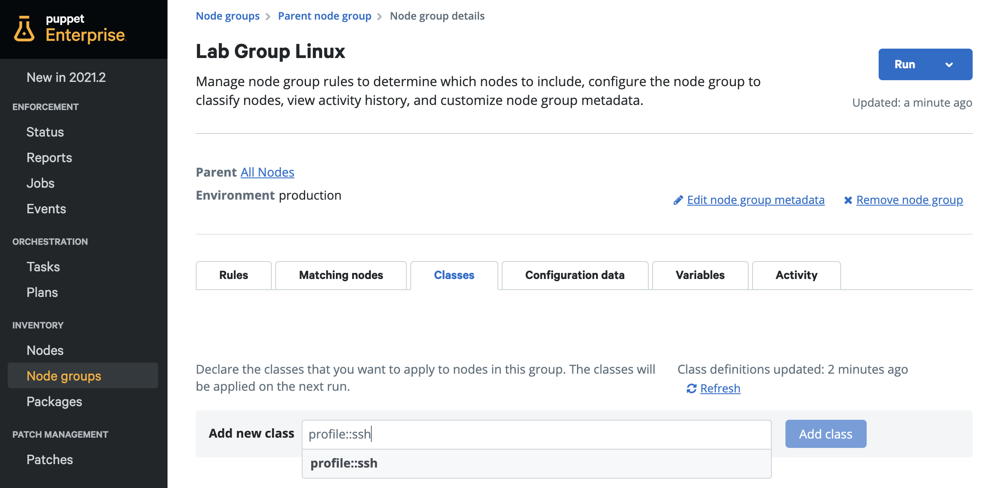
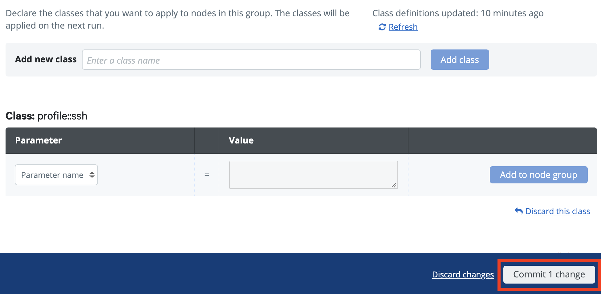
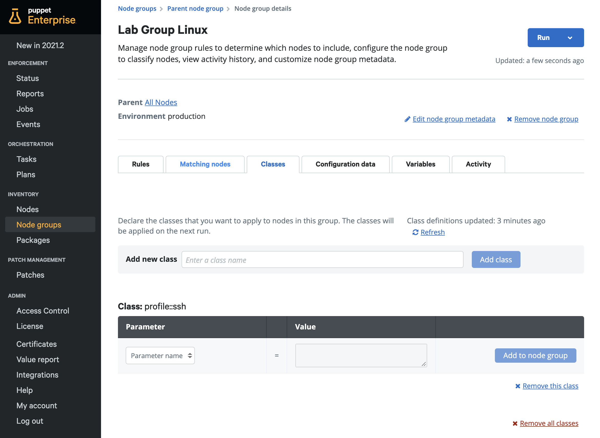
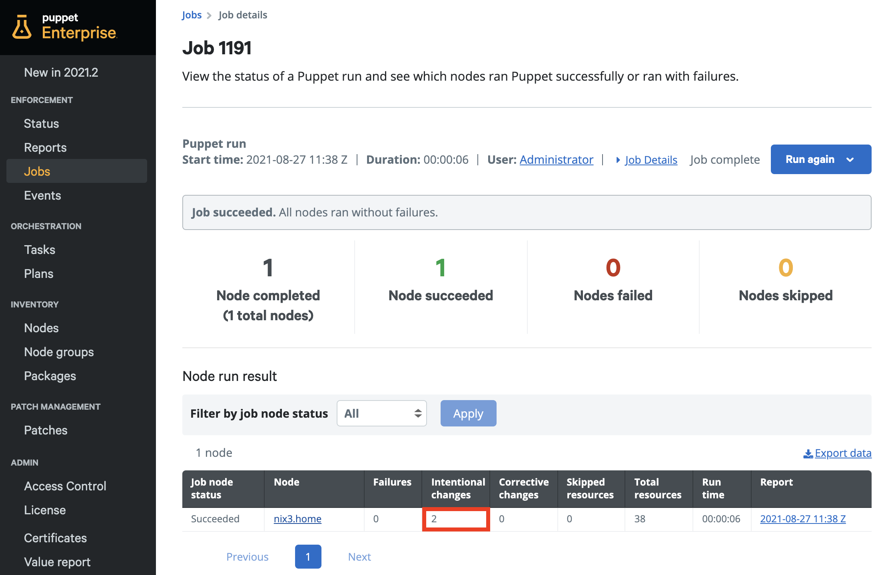
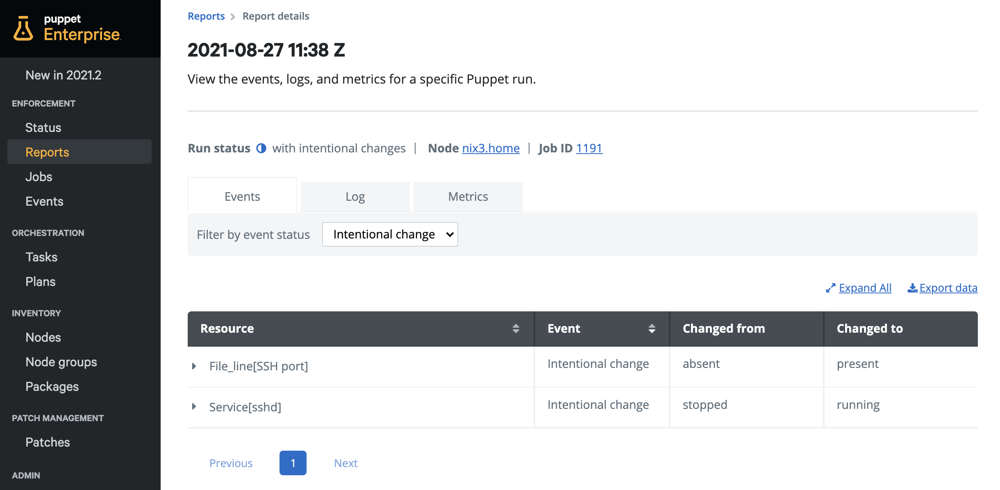
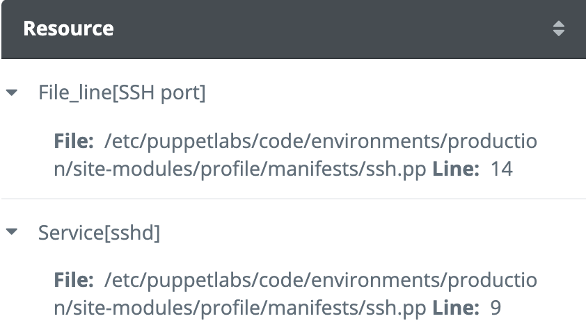

<div class="tocoutline">

### Table of Contents

<div class="toc">

- [Example: SSH Profile](#example-ssh-profile)
  - [Resources](#resources)
  - [Resource Walkthrough](#resource-walkthrough)
  - [Create a manifest](#create-a-manifest)
  - [Class definition](#class-definition)
  - [Adding attributes](#adding-attributes)
  - [Specifying custom attributes via Hiera](#specifying-custom-attributes-via-hiera)
  - [Applying configuration](#applying-configuration)
  - [Reviewing Reports](#reviewing-reports)

</div>

</div>

# Example: SSH Profile<a href="#example-ssh-profile" aria-hidden="true"></a>

This SSH profile is a simple example configuration that configures SSH on Fedora based OSes (RHEL, CentOS, OEL etc). We’ll begin by identifying which resources we need in order to create a basic SSH configuration and then we'll wrap those resources in a class, within a Puppet code manifest.

## Resources<a href="#resources" aria-hidden="true"></a>

If we wanted to manage SSH in a basic way, we would primarily need 3 resources:

* A `package` resource to ensure the software is installed
* A `file_line` resource to manage SSH’s configuration file (or multiple file_line resources to only manage specific settings) - requires <a href="https://forge.puppet.com/modules/puppetlabs/stdlib" target="_blank">puppetlabs/stdlib</a> module.
* A `service` resource to ensure the SSH service is running

Here are those resources:


```puppet
package { 'openssh':				
  ensure => 'present',
}

service { 'sshd':
  ensure => 'running',
  require => Package['openssh'],
}

file_line { 'SSH port':
  path    => '/etc/ssh/sshd_config',
  line    => "Port 22",		
  match   => '^Port',
  notify  => Service['sshd'],
  require => Package['openssh'],
}
```


## Resource Walkthrough<a href="#resource-walkthrough" aria-hidden="true"></a>

The collection of resources shown above will ensure that the line "Port 22" in `/etc/ssh/sshd_config` is configured to the correct value (or the entire line gets added if it doesn’t exist). 

The `require` relationship metaparameter shown in the example above creates a dependency from `service` and `file_line` resource to the `package` resource, meaning that Puppet will only apply the `service` and `file_line` resource after the `openssh` package is installed. The `notify` metaparameter ensures that, if a change was actually made to the "Port" line in `/etc/ssh/sshd_config`, a notification gets sent to the `Service['sshd'] resource`, causing the sshd service to restart so the changes can take effect. A knock-on effect of this is that the `service` resource gets applied after the `file_line` resource.

Once these resources are added to a manifest and applied to a node group, it would result in SSH getting installed, listening on port 22 and the sshd service running. From that point on, that configuration will be continually enforced each time Puppet runs. 

## Create a manifest<a href="#create-a-manifest" aria-hidden="true"></a>

Now we need to wrap our resources in a class within a Puppet manifest so we’ll need to first create our manifest and add it to a place that Puppet looks for manifests (within a module’s manifests subdirectory). As `profile` is a module, we’ll add our manifest to its `manifest` directory and name the file `ssh.pp`.

<div class="noninteractive">

```
control-repo/
└─ site-modules/
   └─ profile/
      └─ manifests/
         └─ ssh.pp
```

</div>

## Class definition<a href="#class-definition" aria-hidden="true"></a>

As mentioned earlier, the naming convention for a class goes as follows - **MODULENAME::MANIFESTNAME**

Location:	`profile/manifests/ssh.pp`

Class name:	`profile::ssh`

This means we’ll need to set `profile::ssh` as our class name at the top of the Puppet manifest.

<span style="text-decoration:underline;">control-repo/site-modules/profile/manifests/ssh.pp</span>


```puppet
class profile::ssh {

  package { 'openssh':
    ensure => 'present',
  }

  service { 'sshd':
    ensure => 'running',
    require => Package['openssh'],
  }

  file_line { 'SSH port':
    path    => '/etc/ssh/sshd_config',
    line    => "Port 22",		
    match   => '^Port',
    notify  => Service['sshd'],
    require => Package['openssh'],
  }
}
```


## Adding attributes<a href="#adding-attributes" aria-hidden="true"></a>

We can make a simple tweak to the Puppet code manifest to leverage the port parameter as an attribute. Now if we wanted to change the port number, we can simply do it at the top of the manifest rather than changing the code below:


```puppet
class profile::ssh (				      
  Integer $port = 22		      
) {				
								   
  package { 'openssh':
    ensure => 'present',
  }

  service { 'sshd':
    ensure => 'running',
    require => Package['openssh'],
  }

  file_line { 'SSH port':
    path    => '/etc/ssh/sshd_config',
    line    => "Port ${port}",		
    match   => '^Port',
    notify  => Service['sshd'],
    require => Package['openssh'],
  }
}
```


## Specifying custom attributes via Hiera<a href="#specifying-custom-attributes-via-hiera" aria-hidden="true"></a>

If we wanted to manage the value of the port variable in Hiera instead, it would be stored in Hiera’s YAML store as:

<span style="text-decoration:underline;">control-repo/site-modules/data/common.yaml</span>


```yaml
profile::ssh::port: 2222
```


## Applying configuration<a href="#applying-configuration" aria-hidden="true"></a>

Once you’ve created a profile or role and pushed it to your Control Repo, it should be available on the Puppet Server within a few seconds. This will happen automatically if the Puppet Server is set to sync with source control each time there’s a commit to the control repo, Alternatively, you’ll need to run `puppet-code deploy --all --wait` directly on the Puppet Server to pull the newest version of the Control Repo. 

You can then navigate to **Node groups** and click on your target node group. Navigate to the **Classes** tab.

Type the name of the class under **Add new class**, choose your class (`profile::ssh`) and then click **Add class** then **Commit 1 change**.







> If your class doesn’t appear, you may need to click **Refresh** to pick up the latest class definitions.

Now that your configuration has been added to your node, it’s time to apply it. From your node group, in the top right corner, click **Run > Puppet** then **Run job**.


## Reviewing Reports<a href="#reviewing reports" aria-hidden="true"></a>

After the Puppet run is complete, you should now see that you have Intentional changes (or corrective changes) with no errors, this means that your configuration has been successfully applied. 



Click on the date and time of the report to navigate directly to it for further details. From there you can easily choose **Intentional change** from the **Filter by event status** dropdown to check the specific resources with changes on this Puppet run as well as any other event status such as **Corrective change** or **Failure**. 



<div class="size50">



</div>

Now when the Puppet agent checks in, it will continually enforce the desired state and report on changes, if there are any.
