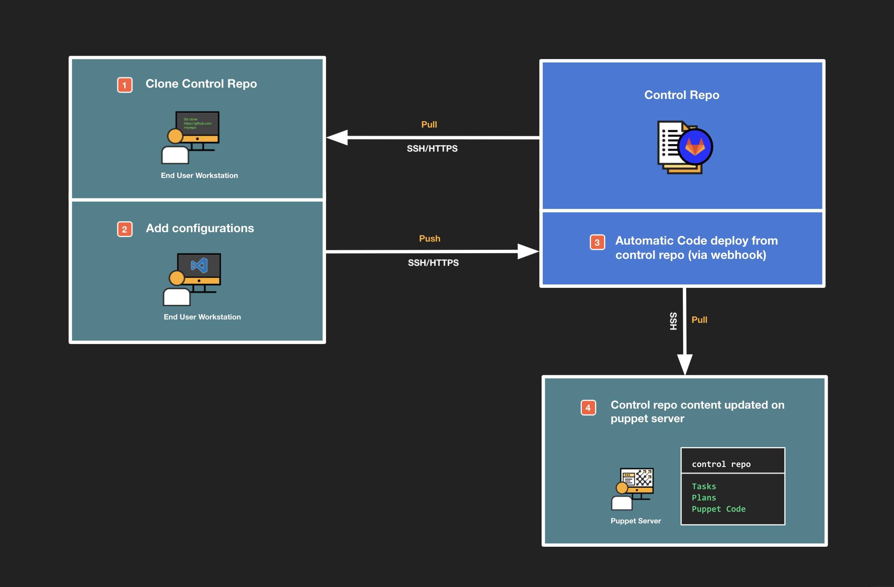

<div class="tocoutline">

### Table of Contents

<div class="toc">

- [What is the Control Repo?](#what-is-the-control-repo)
- [Benefits](#benefits)
- [Pre-Bundled configurations](#pre-bundled-configurations)
- [What can be added to the Control Repo?](#what-can-be-added-to-the-control-repo)
- [How does it work?](#how-does-it-work)
  - [Adding configurations to the Control Repo](#adding-configurations-to-the-control-repo)
    - [Control Repo](#control-repo)
    - [Primary Puppet server](#primary-puppet-server)
    - [Workstation](#workstation)
    - [Workflow Illustration](#workflow-illustration)
- [Control Repo layout](#control-repo-layout)
  - [The Puppetfile](#the-puppetfile)
  - [The site-modules directory](#the-site-modules-directory)
    - [Tasks](#tasks)
    - [Plans](#plans)
    - [Desired State Code](#desired-state-code)
    - [Modules](#modules)
  - [Hiera](#hiera)
    - [Defining Hiera Hierarchy](#defining-hiera-hierarchy)
    - [Hiera data](#hiera-data)

</div>

</div>

# What is the Control Repo?<a href="#what-is-the-control-repo" aria-hidden="true"></a>

The Control Repo is a git based repository that stores and drives all of your configurations in Puppet Enterprise. If you want to add ad-hoc or desired state automation to PE you must first add it to the Control Repo. The Control Repo is connected directly with the Primary Puppet server. Whenever you add new content to the Control Repo, the Primary Puppet server can either automatically or manually pull a new version of the Control Repo so that it has the most up-to-date version of configurations available. 

The Control Repo is the source of truth for all configurations that live in Puppet enterprise.

# Benefits<a href="#benefits" aria-hidden="true"></a>

The Control Repo is one of the most important best practices of using Puppet. While you can technically install modules manually and write uppet code directly on the Puppet server itself, this approach does not scale and generally provides a poor user experience. Using a Control Repo as well as a proper version control system (like Gitlab) and a good editor (like VS Code), are crucial to getting the most out of your Puppet setup.

Here are some additional benefits to using a Control Repo:


* **Team specific requirements/configurations**

    Easy to “branch” code to create team specific configs. Still using the same source.

* **Code reuse**

    Other teams can view configurations and leverage for themselves.  

* **Flexible process for promoting and approving changes**

    i.e. dev > prod code change requires approval from prod environment team.

* **Centralised control**

    Teams pull from and contribute to configurations in one central place. 

* **Reverting changes**

    As all code is “versioned”, it’s easy to see what code/configurations have been changed, and who made the change.

* **Easy audits/proving compliance**

    Easily prove compliance to auditors via source control and reporting in the PE console.


# Pre-Bundled configurations<a href="#pre-bundled-configurations" aria-hidden="true"></a> 

Puppet Enterprise comes with a few ready-to-use bits of automation content out of the box:

* Patch Management
* Puppet Tasks for specific actions:
    * Install Puppet Enterprise agents
    * Manage packages (install/upgrade/uninstall)
    * Manage services (stop/start/restart)


These are managed outside of the Control Repo and are updated by Puppet and rolled into new releases of the Puppet Enterprise.

# What can be added to the Control Repo?<a href="#what-can-be-added-to-the-control-repo" aria-hidden="true"></a> 


Using the Control Repo, you can:

* Use existing automation content/modules from the Puppet Forge
* Use existing automation content from other repositories (public or private)
* Add your own scripts & runbooks for custom automation activities
* Add your own desired state code to enforce system & application configurations

# How does it work?<a href="#how-does-it-work" aria-hidden="true"></a> 

The Control Repo is a repository hosted on a Git-compatible version control system, typically that’s one of these four platforms:

| Cloud-based (SaaS)  | On-premise                             |
| -----------         | -----------                            |
| Github.com          | Github Enterprise                      |
| Gitlab.com          | Gitlab Community/Enterprise Edition    |
| Bitbucket Cloud     | Bitbucket Server                       |
| Azure DevOps        | TFS or Azure DevOps Server             |


## Adding configurations to the Control Repo<a href="#adding-configurations-to-the-control-repo" aria-hidden="true"></a> 

Below you'll find an illustration of the typical workflow used to add configurations to Puppet Enterprise:

<div class="margin">



</div>

For sake of simplicity, the Getting Started labs will focus on using the Gitlab interface to add or edit configurations in the Control Repo. Essentially, Step 2 (as shown above) happens directly in the Control Repo in source control and Steps 3-4 are the same. 

However, we’ll walk through <a href="https://puppet-enterprise-guide.com/theory/workstation-setup.html" target="_blank">setting up the Control Repo on your workstation</a> in the Going Further section of this guide where you'll be following this best practice workflow for the labs within Going Further.

### Control Repo<a href="#control-repo" aria-hidden="true"></a> 

The Control Repo lives within a repository on your chosen source control providers platform and is connected with the Primary Puppet server via SSH. You can add or edit automation content in the Control Repo directly on your source control provider’s interface. That said, it’s best practice to pull a copy of the Control Repo directly to your workstation from your source control provider and use an IDE like VS Code to work with and push automation content.


### Primary Puppet server<a href="#primary-puppet-server" aria-hidden="true"></a> 

The Primary Puppet server can pull new versions of the Control Repo from source control automatically via a webhook or manually by running the relevant <a href="https://puppet.com/docs/pe/latest/puppet_code.html#deploy_environments" target="_blank">puppet code deploy command</a> directly on the Puppet Server. Code management on the Puppet Server is handled via a built-in tool named <a href="https://puppet.com/docs/pe/latest/code_mgr_how_it_works.html#how_code_manager_works" target="_blank">Code Manager</a>. Once new versions of the Control Repo with fresh automation content are pulled down from source control to the Puppet Server, this content will be available to apply to nodes within the Puppet Enterprise console.

### Workstation<a href="#workstation" aria-hidden="true"></a> 

If you want to create configurations locally, following Puppet best practice you should pull a copy of the Control Repo to your workstation from source control. To do this, you’ll need to use either HTTPS and provide your source control credentials or SSH and provide your source control providor with your workstations public key for authentication. 

In this workflow, your workstation pulls a copy of the Control Repo from source control, you make changes or add configurations locally and then push your changes back to source control. The Puppet Server will then pull a new copy of the up-to-date Control Repo from source control automatically or manually, depending on how you’ve set it up.

# Control Repo layout<a href="#control-repo-layout" aria-hidden="true"></a> 

Puppet provides a <a href="https://github.com/puppetlabs/control-repo" target="_blank">template Control Repo on github</a>. We would recommend you start off with this template and customise it as you need in the future. The <a href="https://puppet-enterprise-guide.com/labs/lab-set-up-the-control-repo.html" target="_blank">Set up the Control Repo lab</a> will walk you through cloning this repository for your own use.

Let’s start by taking a look at the layout of the Control Repo, to get a sense of how it works.

<div class="noninteractive">

```markdown
control-repo/
├─ data/                <- This is where all your Hiera values go (YAML based)
│  ├─ nodes/            <- Server-specific Hiera values go here
│  └─ common.yaml       <- Generic default Hiera values go here
├─ manifests/           <- Used for the site.pp only, don't put stuff here
│  └─ site.pp           <- Any code in here gets run on all your servers 
├─ scripts/             <- Contains some core scripts, don't put stuff here
├─ site-modules/        <- This is where your own automation content goes
│  ├─ adhoc/            <- Starting point for Puppet tasks and plans
│  ├─ profile/          <- Starting point for Puppet "profiles" 
│  └─ role/             <- Starting point for Puppet "roles"
├─ CODEOWNERS
├─ LICENSE
├─ Puppetfile           <- This is how you tell Puppet to fetch external content 
├─ README.md
├─ environment.conf     <- Tells Puppet where it can find stuff in this repo
└─ hiera.yaml           <- Configuration for Puppet's layered variable system
```

</div>

## The Puppetfile<a href="#the-puppetfile" aria-hidden="true"></a> 

The first place to start is the `Puppetfile`, this file is essentially a list of all the pre-existing automation content that you want to add to Puppet Enterprise. There are 2 sources from which you can add automation content:


1. The <a href="https://forge.puppet.com" target="_blank">Puppet Forge</a>
2. Custom repositories

A unit of automation content is called a "module". The easiest way to add modules is to download it from the Puppet Forge. For example, to instruct Puppet Enterprise to retrieve version 5.5.0 of the puppetlabs/apache module from the Puppet Forge, add this line to the `Puppetfile`:


```puppet
mod 'puppetlabs/apache',  '5.5.0'
```


If you just want to get the very latest version of the module, change the line to


```puppet
mod 'puppetlabs/apache',  :latest
```


In production, it is recommended to always pin modules to specific versions. This ensures that updated modules don’t automatically get adopted, and puts you in control over which module updates you’re ready to adopt. Modules can have dependencies on other modules, and you’ll need to add those dependent modules to the Puppetfile as well. You can find out more about how use modules from the forge <a href="https://puppet-enterprise-guide.com/theory/forge-example.html" target="_blank">here</a>.

The second option is for when you want to get a module from somewhere other than the Puppet Forge. You still start the definition the same way with `mod '<name of module>'`, but you then use attributes like `git:` and `branch:` or `tag:` to point to a specific repository on either public or private servers. For example, to get the same apache module directly from the source on Github:


```puppet
mod 'apache',
  git: 'https://github.com/puppetlabs/puppetlabs-apache',
  tag: 'v5.5.0'
```


All the possible attributes you can use are documented  <a href="https://puppet.com/docs/pe/latest/puppetfile.html#keep_repository_content_at_a_specific_version" target="_blank">here</a>.

In the <a href="https://puppet-enterprise-guide.com/labs/lab-set-up-the-control-repo.html" target="_blank">next lab</a>, you’ll add a decent starter set of modules to the Puppetfile that enables you to automate the most common use cases on Linux and Windows.

Modules can contain Tasks, Plans, Puppet Desired state code or a combination of those. Any Tasks and Plans from modules you’ve added are immediately available for use in within the "Run a Task" and "Run a Plan" screens of the PE web console. Using desired state code typically requires a few more steps, which we will cover further down below.

## The site-modules directory<a href="#the-site-modules-directory" aria-hidden="true"></a> 

This directory is the starting place for storing your own automation content. Any subdirectory of site-modules is interpreted as being a module. That means that you can migrate any subdirectory of site-modules to its own module repository at a later date, for example if you’d like to give someone else ownership over that piece of content.

### Tasks<a href="#tasks" aria-hidden="true"></a> 

Let’s say you have a collection of existing scripts that you’d like to have available as Tasks in Puppet Enterprise, you can simple add them to `control-repo/site-modules/adhoc/tasks`

<div class="noninteractive">

```
control-repo/
└─ site-modules/
   └─ adhoc/
      └─ tasks/               
         ├─ tasknix.sh
         └─ taskwin.ps1
```
</div>

They will now show up as Tasks in Puppet Enterprise. 

Puppet will automatically namespace the Tasks as:

 **MODULENAME::SCRIPTNAME** 
 
As `adhoc` is technically a module, the name of the tasks will be displayed as:

<div class="noninteractive">

```
adhoc::tasknix
adhoc::taskwin
```
</div>

If you wanted to create a separate module for your tasks for a specific team for example, you can simply add a directory within site-modules with a tasks subdirectory and then add your scripts/tasks:

<div class="noninteractive">

```
control-repo/
└─ site-modules/
   └─ ops_team/
      └─ tasks/
         ├─ logrotation.sh
         └─ diskcleanup.ps1
```
</div>

These tasks will now show up in the Puppet Enterprise console as:

<div class="noninteractive">

```
ops_team::logrotation
ops_team::diskcleanup
```

</div>

There’s a lot more to tasks than just scripts, we'd recommend you check out the <a href="https://puppet-enterprise-guide.com/theory/tasks-overview.html" target="_blank">Tasks</a> section of this guide to find out more.

### Plans<a href="#plans" aria-hidden="true"></a> 

When you want to develop more complex ad-hoc orchestration workflows, you can leverage Plans in Puppet Enterprise. They can be written using the Puppet language or YAML. 

You can add plans to Puppet Enterprise by storing them under `control-repo/site-modules/adhoc/plans`

<div class="noninteractive">

```
control-repo/
└─ site-modules/
   └─ adhoc/
      └─ plans/
         ├─ myplan.pp
         └─ myplanalt.yaml
```
</div>

For puppet language based plans (identified by a .pp extension) the plan name must be defined correctly at the top of the manifest, based on the Puppet naming scheme **MODULENAME::PLANNAME** - as `adhoc` is technically a module, the name of this plan should be written like this: 


```
plan adhoc::myplan {

}
```


This plan will now show up in the Puppet Enterprise console as:

<div class="noninteractive">

```
adhoc::myplan
```
</div>

From this skeleton of a plan, you can start to fill it up with plan steps and ad-hoc automation. 

Check out the <a href="https://puppet-enterprise-guide.com/theory/plans-overview.html" target="_blank">Plans</a> section of this guide to get started.

### Desired State Code<a href="#desired-state-code" aria-hidden="true"></a> 

The template Control Repo contains two subdirectories below site-modules by default, profile and role. These are meant as the starting point for Puppet desired state automation, especially when using existing content. 

The `profile/manifests` directory is where you put manifests that automate a specific thing by calling some existing automation content, with parameters to control the behavior. 

The `role/manifests` directory is where you put manifests that call one or more of those profiles, so that you end up with a single configuration that you can assign to one or more servers.

<div class="noninteractive">

```
control-repo/
└─ site-modules/
   └─ profile/
   │  └─ manifests/   
   └─ role/
      └─ manifests/
```

</div>

In this example we have an apache_web manifest located in `site-modules/profile/manifests`

<div class="noninteractive">

```
control-repo/
└─ site-modules/
   └─ profile/
      └─ manifests/
         └─ apache_web.pp
```

</div>

For both roles and profiles, the class name must be defined correctly at the top of the manifest, based on **MODULENAME::MANIFESTNAME** - as `profile` is technically a module, the name of this class should be `profile::apache_web `and expressed like this:


```puppet
class profile::apache_web {
  class { 'apache':
    default_vhost => false,
  }
  apache::vhost { 'vhost.example.com':
    port    => '80',
    docroot => '/var/www/vhost',
  }
}
```


Now you have a `profile::apache_web` that you can use as a unit of automation, like a Lego brick. You can now use that Lego brick as part of a role. 

Let’s say you create another lego brick you’d like to use in order to complete your role, for example, a baseline manifest named `profile::baseline` which contains automation to configure some basic OS settings. 

Now you want to create a role that combines both Lego bricks, so that you can easily assign this role to a server. 

You can create a role manifest within the `manifests` subdirectory within the `role` directory. In this instance, we’ll name it `web_server.pp`

<div class="noninteractive">

```
control-repo/
└─ site-modules/
   └─ profile/
   │  └─ manifests/
   │     └─ apache_web.pp
   │     └─ baseline.pp
   └─ role/
      └─ manifests/
         └─ web_server.pp
```

</div>

Like the `profile` directory, the `role` directory is technically also a module which means the class definition at the top of the Puppet manifest must correspond to the **MODULENAME::MANIFESTNAME** naming scheme.

This means class definition for the **role** should look like this:


```puppet
class role::web_server {
}
```


Now you can easily add the two lego bricks `profile::baseline` and `profile::apache_web`  with an include declaration to form a complete configuration:


```puppet
class role::web_server {
  include profile::baseline
  include profile::apache_web
}
```


Now you have a single role, `role::web_server,` that you can assign to a server in the Puppet Enterprise user interface.

### Modules<a href="#modules" aria-hidden="true"></a> 

You can create a module by creating a subdirectory under site-modules. In the example below, we'll create a module/directory named `ops_baseline`. 

<div class="noninteractive">

```markdown
control-repo/
└─ site-modules/
   └─ ops_baseline/
```

</div>

There are a number of possible directories that you can create within `ops_baseline`, however, if you want create a basic module layout that contains tasks, plans and desired state Puppet code, you’ll need just 3 directories, `tasks, plans` and `manifests`.

<div class="noninteractive">

```markdown
control-repo/
└─ site-modules/
   └─ ops_baseline/
      ├─ manifests/        <- This is where Puppet desired state code lives
      ├─ plans/            <- This is where Puppet Plans go 
      └─ tasks/            <- This is where Puppet Tasks go
```

</div>

There are a number of supporting directories that can also be used to form a more complete structure of a module as shown below: 

<div class="noninteractive">

```markdown
control-repo/
└─ site-modules/
   └─ ops_baseline/
      ├─ data/             <- Used for module-specific variable defaults
      ├─ facts.d/          <- Easiest way to add an external fact
      ├─ files/            <- A place to store (small) files
      ├─ functions/        <- A place to store custom Puppet functions
      ├─ lib/              <- A place to store custom Ruby functions 
      ├─ manifests/        <- This is where Puppet desired state code lives
      ├─ templates/        <- A place to store templates for files
      ├─ plans/            <- This is where Puppet Plans go 
      ├─ spec/             <- A place to store automated testing definitions
      └─ tasks/            <- This is where Puppet Tasks go
```

</div>

When you use the <a href="https://puppet.com/docs/pdk/2.x/pdk.html" target="_blank">Puppet Development Kit (PDK)</a> to create modules, the module structure shown above is automatically created for you. 

We will dig a little deeper into on modules in the Going further section of the guide. 

## Hiera<a href="#hiera" aria-hidden="true"></a> 

This is the builtin way that Puppet allows you to define variables for individual servers, or groups of servers. It’s called Hiera, due to the hierarchical structure that it lets you define. When using Hiera, Puppet code will only contain code and logic and data lives in Hiera. Attributes or Parameters within Puppet code directly reference data in Hiera. When a Puppet run occurs, data within Hiera and code/logic within Puppet code are resolved and a "complete configuration" is applied to nodes.

We’re not going any deeper on Hiera right now, as we'll walk you through Hiera in greater detail within the <a href="https://puppet-enterprise-guide.com/theory/hiera-overview.html" target="_blank">Hiera section</a> of this guide.

### Defining Hiera Hierarchy<a href="#defining-hiera-hierarchy" aria-hidden="true"></a> 

You define layers of variables, from the most-specific (e.g. per server) to the least-specific (e.g. common default) using the path key within the hiera.yaml file. 

<div class="noninteractive">

```markdown
control-repo/
└─ hiera.yaml       
```

</div>

Contents of hiera.yaml:


```puppet
---
version: 5

defaults:
  datadir: "data"

hierarchy:
  - name: "Yaml backend"
    data_hash: yaml_data
    paths:
      - "nodes/%{trusted.certname}.yaml"
      - "common.yaml"
```


### Hiera data<a href="#hiera-data" aria-hidden="true"></a> 

The **data** subdirectory houses the actual YAML files that contain the variables for your configuration. 

<div class="noninteractive">

```markdown
control-repo/
└─ data/            		            <- This is where all your variables go
   ├─ nodes/        		  
   │	└─ mynodecertname.yaml          <- Node specific values go here
   └─ common.yaml   		            <- Generic default values go here
```

</div>
