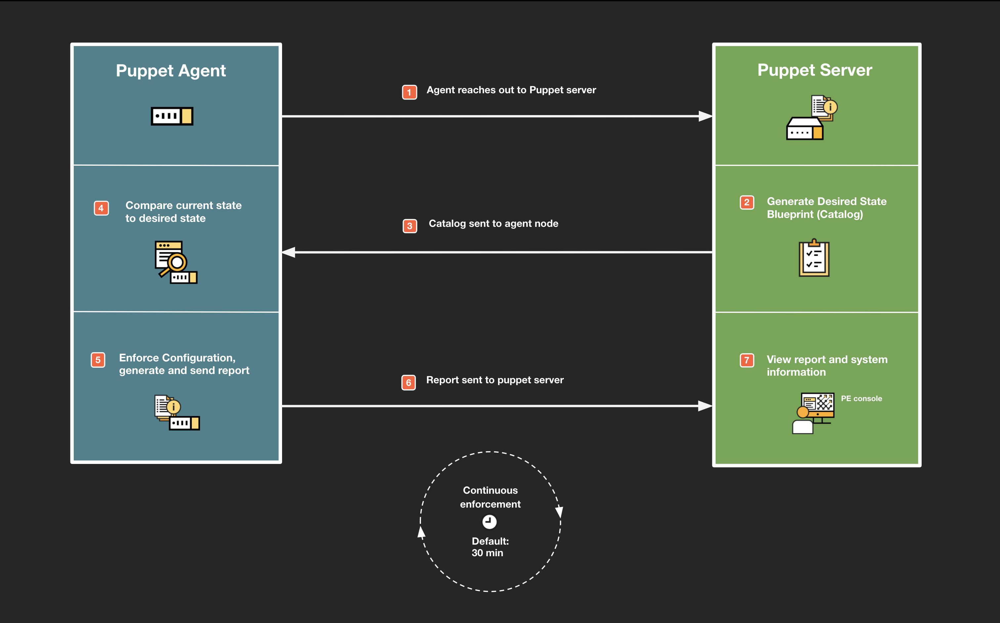

### Table of Contents

- [What is Desired State Enforcement?](#what-is-desired-state-enforcement)
- [Primary Use Cases](#primary-use-cases)
- [Benefits](#benefits)
- [Key Components](#key-components)
    - [Control Repo](#control-repo)
    - [Puppet Server](#puppet-server)
    - [Puppet Agent](#puppet-agent)
    - [Puppet Database](#puppet-database)
- [How does it work?](#how-does-it-work)
  - [Preparation](#preparation)
  - [Desired State Enforcement](#desired-state-enforcement)
  - [Post enforcement](#post-enforcement)

# What is Desired State Enforcement?

Desired state automation allows you to express the end state of infrastructure rather than all of the various steps to get there. On top of that, it’s not just configured once but is continually enforced which avoids configuration drift and ensures targets are in a compliant state. You express your desired state by using a simple human readable language called Puppet code. 

An easy way to understand desired state vs ad-hoc scripting is the “making a sandwich” analogy:

### Making a sandwich - Scripting approach:

* Get two slices of bread
* Butter one side of each
* Get cheese, tomato and lettuce and relish from the fridge
* Slice cheese, tomato and lettuce 
* Place on one slice of bread
* Add relish
* Place other slice of bread on filling slice
* Slice sandwich in two
* Grab a plate
* Place sandwich on plate
* Put all the ingredients back in the fridge
* Bring me sandwich

### Making a sandwich - Desired state approach:

Please make me a sandwich with:

* Cheese 
* Tomato
* Lettuce
* Relish

This approach is pretty powerful and is useful for particular scenarios that require a consistent approach to configuration. Whilst this approach is great, there are sometimes where you actually may _want_ to be more explicit in how you want a particular configuration task to be carried out, such as application deployment or patching, which is precisely why Puppet supports both approaches.

# Primary Use Cases

* Compliance and Server Hardening
* Security baselines for OS and applications (CIS etc)
* Consistent build process
    * OS level system configuration
    * Ensuring essential system services are continually running
    * Firewall settings
    * File/user permissions
    * Application packages
* Complex application and supporting component configuration

# Benefits

* More robust than fragile scripts
* Agent based
    * Bi-directional, latency robust connection (using Puppet transport)
    * Nodes are securely authenticated with Puppet Enterprise
    * Providing credentials not necessary
    * Workload takes place on node for effortless scaling 
* Avoid config drift due to continual enforcement
* Simply define the state you want, not the steps to get there
* Reporting on “intentional” and “corrective” changes (config drift)
* Infrastructure configurations are correct and consistent
* Makes audits much faster to complete and less expensive to perform

# Key Components

### Control Repo

The Control Repository is where infrastructure configurations and automation lives. The Control Repo is a repository that lives in a git based source control system (such as Gitlab, Github etc). You’ll use the Control Repo to not only store your own configurations but also to specify pre-built automation, known as modules from the Puppet Forge.

### Puppet Server

The Puppet Server is the orchestrator of change within Puppet Enterprise. It connects with the Control Repo to understand all available configurations. It controls which nodes get which configuration and orchestrates Puppet agent runs to automatically enforce state/configuration. 

### Puppet Agent

The Puppet agent is installed and runs on managed nodes to ensure enforcement of configuration sent from the Puppet Server. It also gathers system information and generates reports based on the activities performed during enforcement which is sent back to the Puppet server.

### Puppet Database

When reports are sent from the Puppet agent to the Puppet server, they are stored in the Puppet database which is part of the Puppet server. This includes changes across your infrastructure as well as key system information about nodes, known as facts.

# How does it work?

The process of desired state enforcement is carried out in tandem by the Puppet server (which manages nodes) and the Puppet agent (which is installed on managed nodes). Instructions based on the desired state that you defined in code, are sent from the Puppet server to the target nodes. The agent then enforces this desired state in what is called a “Puppet run” and reports back to the Puppet server what changes, if any, were made to conform the node to the desired state. As part of the run, the agent also submits updated key system information (called “facts”) like available memory, disk space, patch information package and much more.

Below you can find an overview of what's involved in the desired state process.

## Preparation

### 1. Puppet Console - Add nodes

The Puppet Server includes a built-in certificate authority for managing certificates, which is responsible for authentication between the Puppet Server and Puppet agent nodes. You can add nodes through SSH/WinRM through the Puppet console. The agent software will be deployed to targets. Following that, agent nodes can request certificates through the Puppet server’s certificate authority which can be approved in the Puppet console.

### 2. Control Repo - Create or add configurations

Configurations are stored in the Control Repo, in source control. The Control Repo is directly connected with the Puppet Server. 

### 3. Puppet Server - Pull configurations

The Puppet Server, which orchestrates automation, is connected with source control and pulls new code/configurations from the Control Repo, whenever they are available or this can be set up to be a manual trigger. 

### 4. Puppet Console - Assigning configurations

Nodes are assigned configurations by creating node groups in the Puppet console, for example, you could create a “webserver” node group and then assign relevant nodes and configurations to that node group. This means that every node which is part of the “webserver” node group will receive the configuration(s) assigned to it. Once you’ve told the Puppet Server which nodes should get which configurations via node groups, it’s time to kick off a Puppet run to enforce state.

## Desired State Enforcement

Below you can find a high level illustration of the Puppet desired state model.

### 1. Agent reaches out to Puppet Server
As standard, Puppet agents reach out to the Puppet Server automatically, every 30 minutes to check what state they should be in. It can also be manually triggered from the Puppet console. The Puppet Server and Puppet agent communicate over a secure and latency robust transport named PCP. Communication over this protocol is initiated from the Puppet agent but is bi-directional and does not require credentials as it uses certificates for authentication.

### 2. Generate Desired State Blueprint (catalog)
The Puppet server will generate a catalog whenever an agent node checks in. A catalog is essentially a desired state blueprint of which configurations need to be enforced based on the configurations applied to your nodes via node groups.

### 3. Catalog sent to agent node
The newly generated catalog is sent to the agent node.

### 4. Compare Current state to Desired state

Once the Puppet agent node has received the catalog from the Puppet Server, it will look at the instructions in the catalog for how the system should be configured and then check that configuration against its current configuration state to understand what changes need to be made, if any. This dynamic checking is one of the key strengths of the Puppet agent as it won’t try to continually override configurations, regardless of the current state (like a script would typically do). It’s smart enough to understand exactly what needs to be done based on the current state.

### 5. Enforce configuration and generate report

Once the Puppet agent has understood the actions to be performed based on the catalog and current state, it will then enforce/configure them. It will then generate a report of what changes occured based on their type. There are two main types of changes:

**Intentional changes:** These are changes that are new and have been intentionally coded by an admin. Intentional changes happen when a resource first comes under Puppet management (and its configuration needs changes to bring it into the desired state), or when the desired state of an already-managed resource is changed in the Puppet code.

**Correctional changes:** These are changes that have occurred due to configuration drift. If Puppet is currently managing these resources it will remediate configuration drift by reverting changes back to the desired state that you originally set. It will then report that there were correctional changes and detail what those changes were. This helps keep infrastructure configurations consistent and can assist with troubleshooting as to why this drift might be occurring.

During this time, the agent will also leverage a built in tool named **facter** to automatically pull and store key system information like memory capacity/use, disk size/space and much more. This information, known as **facts**, will be gathered and placed in the report along with the actions that took place during the Puppet run in regards to enforcement.

### 6. Report sent to Puppet server
Whenever the Puppet run finishes up, the Puppet agent generates a report and is then sent to the Puppet Server.

## Post enforcement

### 7. View Report and System information
When reports are sent to the Puppet Server, they are stored in a database, built-in to the Puppet Server called **PuppetDB**. All of this information is then available in the Puppet Enterprise console, allowing you to drill down in what types of changes occurred during the Puppet run such as corrective or intentional changes and the specifics of each. **Facts** gathered on nodes during the Puppet run will also be updated in PuppetDB. You can then use these facts to query nodes, run reports or group nodes dynamically in order to apply configuration. Information in PuppetDB is also queryable via a set of APIs.

### Continuous Enforcement

The Puppet agent, as default will check in with the Puppet Server every 30 mins (but is configurable) meaning that once you set your desired state, the process described above will repeat, automatically. This means that if managed infrastructure configurations have drifted within a 30 minute window, Puppet will revert the drifted configuration(s) back to the desired state you set and then report on actions taken. Any resource on the system that is **not** managed by Puppet, will not see any changes to its configuration reverted; Puppet only enforces things that you tell it to. Fact information is also updated as part of the Puppet run, meaning that Puppet Enterprise has up to date information on the state of configurations and system information of managed nodes.
