<div class="tocoutline">

### Table of Contents

<div class="toc">

- [Example: Apache module](#example-apache-module)
  - [Exploring the module listing](#exploring-the-module-listing)
    - [Project url](#project-url)
    - [Report issues](#report-issues)
    - [Version information](#version-information)
    - [Module author and stats](#module-author-and-stats)
    - [Module dependencies](#module-dependencies)
  - [Installing Modules](#installing-modules)
    - [Verify Installation](#verify-installation)
    - [Where are modules installed?](#where-are-modules-installed)
  - [Creating configurations](#creating-configurations)
    - [Usage examples](#usage-examples)
    - [Location and Namespacing](#location-and-namespacing)
    - [Reference tab](#reference-tab)
    - [Viewing additional parameters](#viewing-additional-parameters)
    - [Default values](#default-values)
    - [Adding additional parameters](#adding-additional-parameters)
  - [Applying configuration](#applying-configuration)
  - [Reviewing Reports](#reviewing-reports)
- [Troubleshooting](#troubleshooting)

</div>

</div>

# Example: Apache module<a href="#example-apache-module" aria-hidden="true"></a>

In this example, we’ll be downloading and installing the apache module with it's required dependencies. We'll then go on to create a configuration to set up a basic Apache webserver with a custom vhost, doc root and port configuration.

The first place to start is <a href="forge.puppet.com" target="_blank">forge.puppet.com</a>, where we can simply search for the apache module and navigate to the <a href="https://forge.puppet.com/modules/puppetlabs/apache" target="_blank">apache module page</a>.

## Exploring the module listing<a href="#exploring-the-module-listing" aria-hidden="true"></a>

When navigating to a given module on the Forge, you’ll be presented with it's documentation containing useful information including, but not limited to quality score, version information/platform compatibility, install information and coded examples.

<div class="size80">

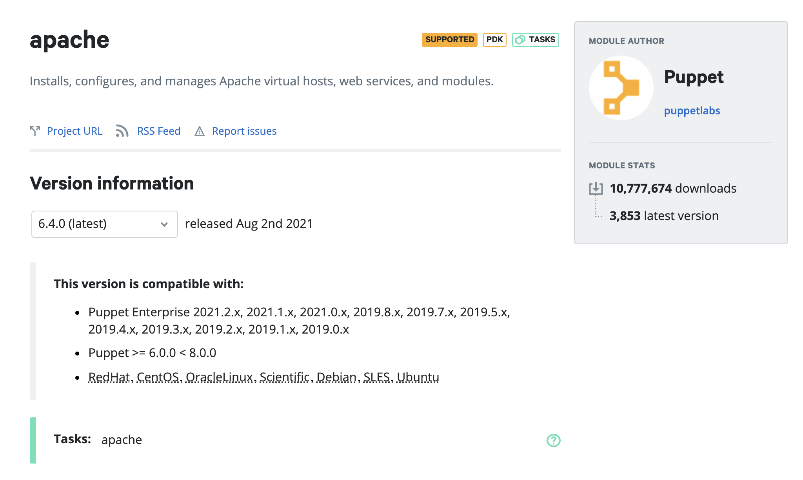

</div>

### Project url<a href="#project-url" aria-hidden="true"></a>

The project URL is a link directly to the git repository of the module. This is useful for reviewing the module’s Puppet code without the need to install it locally. It also allows the community to contribute to the module or raise feature requests.

### Report issues<a href="#report-issues" aria-hidden="true"></a>

If you’ve an issue with a module, this link will take you directly to the issues section of the git repository where you can open an issue with the module author directly.

### Module author and stats<a href="#module-author-and-stats" aria-hidden="true"></a>

On the top right of the module listing, you’ll find the author of the module and the stats associated with the module - total amount of downloads, amount of downloads of the current version and a quality score rating to help you understand the quality of the Puppet code within the module and how well it aligns with Puppet best practices. 

### Version information<a href="#version-information" aria-hidden="true"></a>

Under this section, you can find a bunch of useful information, such as current version and when the module was released as well as any older releases.

It will also include important information around compatibility. It’s usually broken down into 3 key areas: 

* Puppet Enterprise version
* Puppet agent version
* Target operating system compatibility

 The author of the module is reponsible for keeping this information up to date and there are cases when this information is out of date. Sometimes modules will be compatible with newer versions of Puppet Enterprise, Puppet agent version or target operating system than described. We would always recommend you test out module functionality in a development environment before rolling it into production use.

Any operating system that is underlined, will specify which specific versions of a given operating system it supports, for example Windows - 8, 10, 2016, 2019 or RedHat - 6,7,8.

<div class="size80">

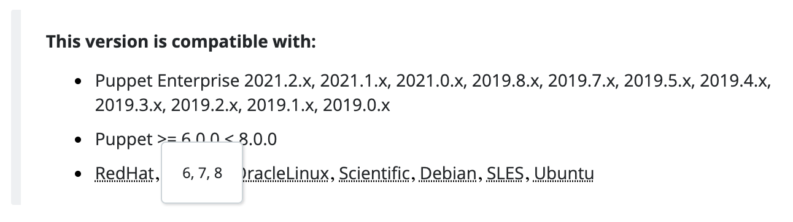

</div>

### Module dependencies<a href="#module-dependencies" aria-hidden="true"></a>

Modules will sometimes leverage other module’s code to leverage additional functionality that isn’t currently available in Puppet’s core language. A module requiring dependencies will not work correctly If it’s dependencies have not been satisfied. It’s important when installing any modules that you check the “Dependencies” tab and ensure that the relevant modules and their versions are specified along with the module you wish to use.

Under the <a href="https://forge.puppet.com/modules/puppetlabs/apache/dependencies" target="_blank">dependencies tab</a> we see that this module requires two additional modules:

* Puppetlabs/stdlib (>= 4.13.1 &lt; 8.0.0)
* Puppetlabs/concat (>= 2.2.1 &lt; 8.0.0)

<div class="size50">

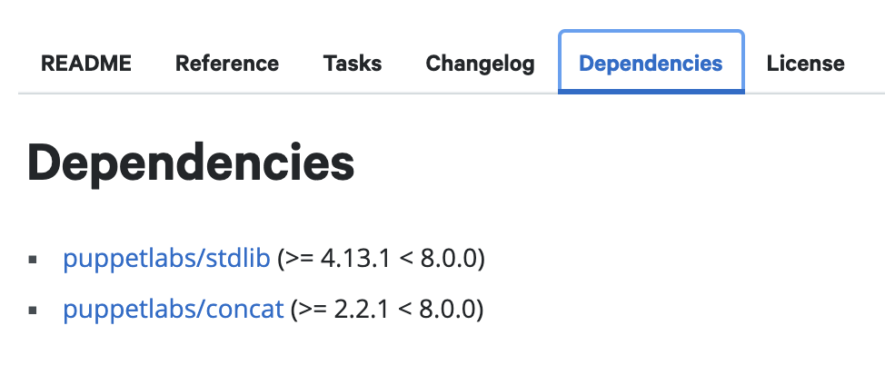

</div>

Along with the apache module, we must install these modules within the version range specified. 

> There are some instances where the dependencies themselves will also have dependencies on other modules. Before installing any module, you should always check whether there are any dependencies and install them.

> Like compatibility info, the dependency information isn’t always fully up to date, especially when it comes to the supported versions of dependent modules. The minimum version tends to be well defined, but the maximum version can become out of date if the dependent module has frequent releases. Don’t assume a version higher than the listed maximum version for a dependency won’t work, it likely will. As always, properly testing updates is your best friend.

## Installing Modules<a href="#installing-modules" aria-hidden="true"></a>

You’ll find multiple methods to install modules in the **Start using this module** section at the top of any modules page. Since we are using a Control Repo stored in source control, Puppet Code Manager handles all interactions between source control and the Puppet Server. This means that we need to specify which modules we want to use via the **Puppetfile**, in the Control Repo. 

Let’s first take another look at the basic structure of our Control Repo:

<div class="noninteractive">

```
control-repo/
├─ data/            
├─ manifests/
├─ scripts/
├─ site-modules/     <-- This is where your own automation content goes
├─ Puppetfile        <-- This is how you tell Puppet to fetch modules
├─ environment.conf
└─ hiera.yaml       
```
</div>

To now install the module, we can simply expand the **r10k or Code Manager** section on the Forge and copy the module declaration shown and then simply paste it as a new line within the **Puppetfile**. 

<div class="size50">

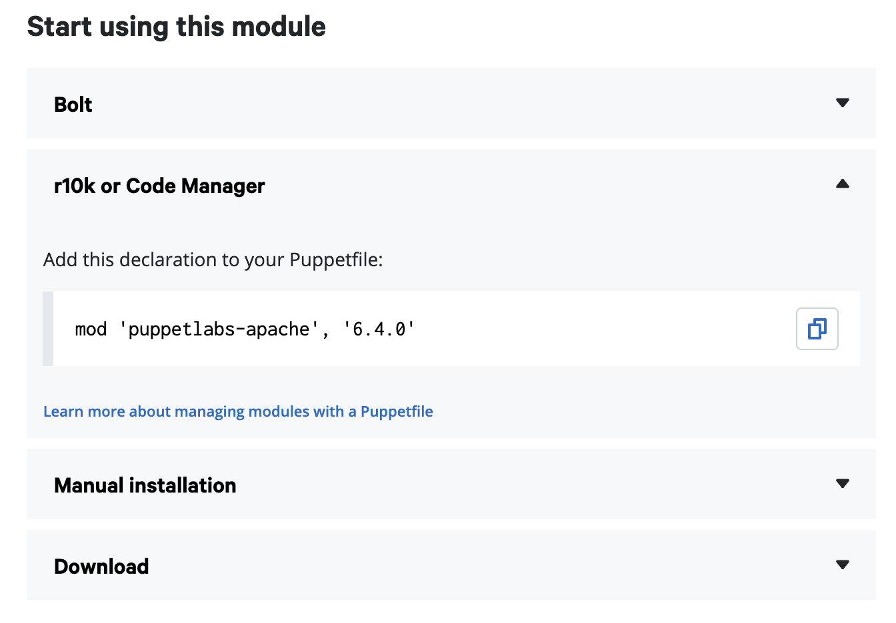

</div>

If you’ve been following the previous labs, Code Manager should automatically fetch new code after you commit your change to the Puppetfile and deploy it to the Puppet Server. If not you’ll need to perform a Puppet code deploy manually by running `puppet-code deploy --all --wait` directly on the Puppet Server.

Make sure and include the [Module dependencies](#module-dependencies) for your chosen module, as shown in the **Puppetfile** example below:

`control-repo/Puppetfile`

```puppet
forge 'https://forge.puppet.com'

mod 'puppetlabs-apache', '6.4.0'
# apache module dependencies
mod 'puppetlabs-stdlib', '7.1.0'
mod 'puppetlabs-concat', '7.0.1'
```


### Verify Installation<a href="#verify-installation" aria-hidden="true"></a>

You can verify your module has been successfully installed by connecting to your Puppet Server via SSH and running `puppet module list --tree`. This command will not only show installed modules but also flag any modules with unmet dependencies. This is particularly useful when troubleshooting module installation issues. 

If you find that module classes aren’t showing up in the console when trying to add them to a node group, ensure you’ve refreshed class definitions (within the target node group, under the Classes tab) by clicking “refresh”. Once refreshed, try typing in a class from the module for example, if you’ve installed the apache module and you can type “apache” in  the “add new class” field and you should see all classes associated with that module appear. 

### Where are modules installed?<a href="#where-are-modules-installed?" aria-hidden="true"></a>

When the Control Repo gets deployed to the Puppet Enterprise server, the modules referenced in the `Puppetfile` will be downloaded and installed.

On the Puppet Enterprise server, this results in an additional directory named `modules`

`/etc/puppetlabs/code/environments/production/`
<div class="noninteractive">

```
├─ data/
├─ manifests/
├─ modules/         <- Modules installed from the Puppetfile
│  ├─ apache/       <- First module (alphabetically) from our Puppetfile
│  ├─ concat/       
│  └─ stdlib/       <- Last module (alphabetically) from our Puppetfile
├─ scripts/
├─ site-modules/    <- This is where your own automation content goes
├─ Puppetfile
├─ environment.conf
└─ hiera.yaml
```
</div>

By default, Puppet will look in the `modules` and `site-modules` directories for automation content. Any modules found under either directory share the same namespace, so every module must have a unique name. Puppet also expects any classes in a module to be namespaced with the name of that module. So for example, the names of any classes defined in the `apache` module would have the prefix `apache::`followed by the class name (excluding the apache class itself).

Classes are expected to be in a `manifests` subdirectory of a module. Let’s take a look at some examples:

`/etc/puppetlabs/code/environments/production/modules`

<div class="noninteractive">

```
├─ modules/
   └─ apache/             <- Apache module
      └─ manifests/
         ├─ init.pp       <- apache class
         ├─ fastcgi/
         │  └─ server.pp  <- apache::fastcgi::server class
         └─ vhost.pp      <- apache::vhost class
```
</div>

The examples above show the following:

* Class definitions in a manifest within a module have to start with the module’s name
* `init.pp` is a special manifest name, which gives that class the name of the module itself. `init.pp` results in an `apache` class, as it is the module’s name.
* Namespaces are separated by double colons (`::`)
* Subdirectories of the manifests directory become part of the namespace structure (`apache::fastcgi::server`)

## Creating configurations<a href="#creating-configurations" aria-hidden="true"></a>

Every module on the Forge will include coded examples in it’s documentation demonstrating how to use key functionality. This means that in a lot of cases, you can simply copy and paste the contents of the examples into a manifest of your own, substituting configuration parameters out for your own. After that, you can simply add the manifest or profile to a node group in the Puppet console and run Puppet to enforce the configuration. 

Whilst most modules will have plenty of coded examples, they won’t cover _all_ of a given module’s capabilities. 

### Usage examples<a href="#usage-examples" aria-hidden="true"></a>

Below we’ve put together a manifest using two usage examples found on the module’s readme section - There are several examples on the module’s usage section but we’re going to leverage some of the basic ones found <a href="https://forge.puppet.com/modules/puppetlabs/apache/readme#beginning-with-apache" target="_blank">here</a>. 

At the beginning of our manifest, we leverage the `apache` class to install the apache software and configure some defaults. In this instance, we’re setting the `default_vhost` parameter to `false` as we’re specifying a custom vhost in the same manifest. Here’s how we would express that:


```puppet
class { 'apache':
  default_vhost => false,
}
```

When defining a custom vhost, the apache module leverages the `apache::vhost` defined resource type. We are also specifying a port number and custom docroot location. Here’s how that would look:


```puppet
apache::vhost { 'vhost.example.com':
  port    => '80',
  docroot => '/var/www/vhost',
}
```

Once we put it all together, we’ve got a basic apache configuration. In this instance, we only need to change the apache vhost name and specify a custom docroot:

```puppet
class { 'apache':
  default_vhost => false,
}
apache::vhost { 'nix3.home':
  port    => '80',
  docroot => '/var/www/nix3.home',
}
```

> This example assumes you've created the relevant directory structure within `/var/www` outside of this configuration and that you'll provide some webcontent to serve up. Whilst out of scope for this example, you can also use Puppet to configure this directory structure and it's content.

### Location and Namespacing<a href="#location-and-namespacing" aria-hidden="true"></a>

Now that we have the Puppet code we want, we need to create a Puppet manifest to house it. We’ll create a manifest `apache_web.pp` in the `profile/manifests` directory of our Control Repo. As described in the <a href="https://puppet-enterprise-guide.com/theory/defining-state-in-code.html#location" target="_blank">Defining State in Puppet code</a>, the `profile` directory is technically a module. Based on the Puppet namespacing scheme **MODULENAME::MANIFESTNAME** our class definition should be **profile::apache_web**.

**<span style="text-decoration:underline;">Control Repo location:</span>**

<div class="noninteractive">

```
control-repo/
└─ site-modules/
   └─ profile/
      └─ manifests/
         └─ apache_web.pp
```

</div>

**<span style="text-decoration:underline;">Manifest:</span>** `apache_web.pp`

```puppet
class profile::apache_web {
  class { 'apache':
    default_vhost => false,
  }
  apache::vhost { 'nix3.home':
    port    => '80',
    docroot => '/var/www/nix3.home',
  }
}
```


Once this configuration is pushed to the Control Repo and synced with the Puppet Server, it will be available as a class in the PE console that can be applied to node groups.

### Reference tab<a href="#reference-tab" aria-hidden="true"></a>

The reference tab on a module listing will usually display all of the available <a href="https://puppet.com/docs/puppet/latest/lang_classes.html" target="_blank">Classes</a>, <a href="https://puppet.com/docs/puppet/latest/lang_defined_types.html" target="_blank">Defined resource types</a>, <a href="https://puppet.com/docs/puppet/latest/lang_resources.html" target="_blank">Resources</a> and <a href="https://puppet.com/docs/puppet/latest/lang_functions.html" target="_blank">Functions</a> that can be used with the module. Essentially, the reference tab shows all the various components that can be configured in a given module, which class, resource, etc needs to be used to configure said components and which parameters it accepts. The majority of the time, you’ll be working with classes, defined types and resources. Functions are generally only required for more advanced usage.

If we navigate to the <a href="https://forge.puppet.com/modules/puppetlabs/apache/reference" target="_blank">Reference tab</a> of the apache module, we’ll be presented with a table of contents of all available configuration parameters. 

<div class="size50">

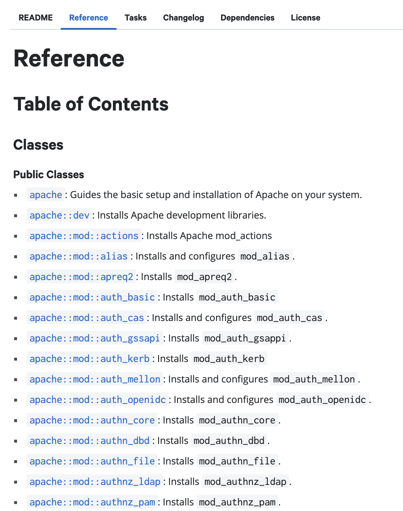

</div>

### Viewing additional parameters<a href="#viewing-additional-parameters" aria-hidden="true"></a>

The documentation readme shows some basic examples when configuring an apache vhost using the `apache::vhost` defined resource type but if we want to get a full breakdown of all the different parameters that you can use for this particular configuration parameter, you’ll need to navigate to the <a href="https://forge.puppet.com/modules/puppetlabs/apache/reference#apachevhost" target="_blank">`apache::vhost` defined type</a> within the Reference tab.

After navigating to the `apache::vhost` defined type in the reference tab, you should see all the parameters available to it.

<div class="size50">

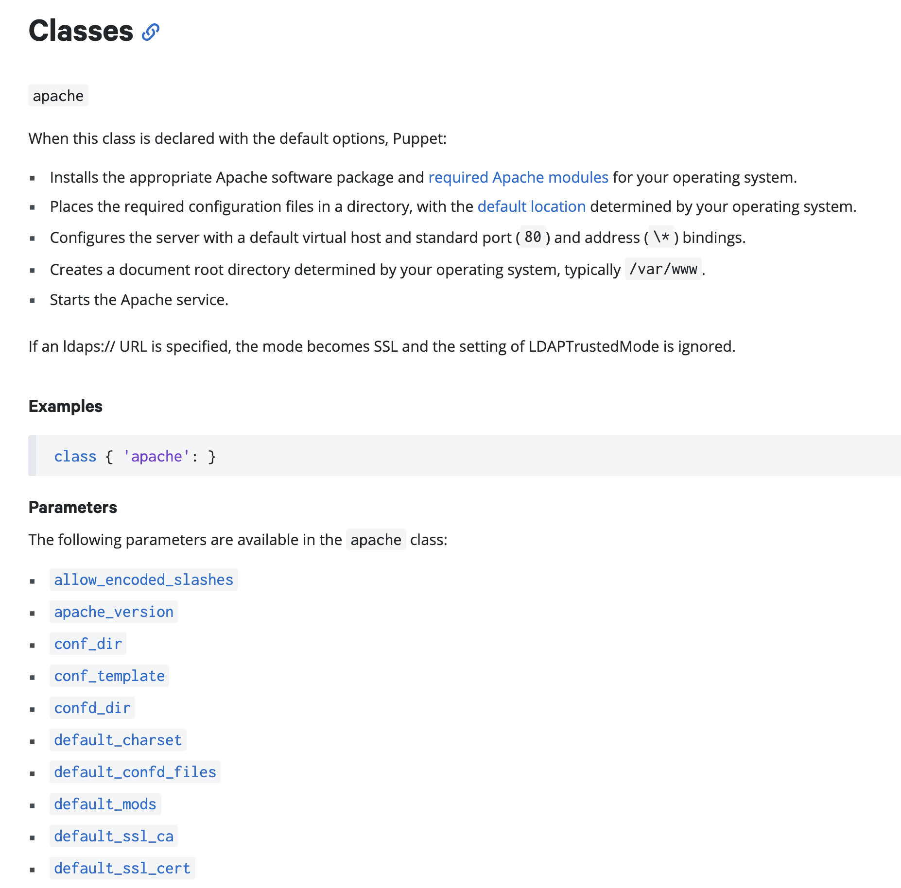

</div>

 If you click on a parameter, for example <a href="https://forge.puppet.com/modules/puppetlabs/apache/reference#keepalive_timeout" target="_blank">keep_alive_timeout</a>, it’ll show which data type the parameter accepts and what the default value is if a custom value isn’t specified.

<div class="size50">

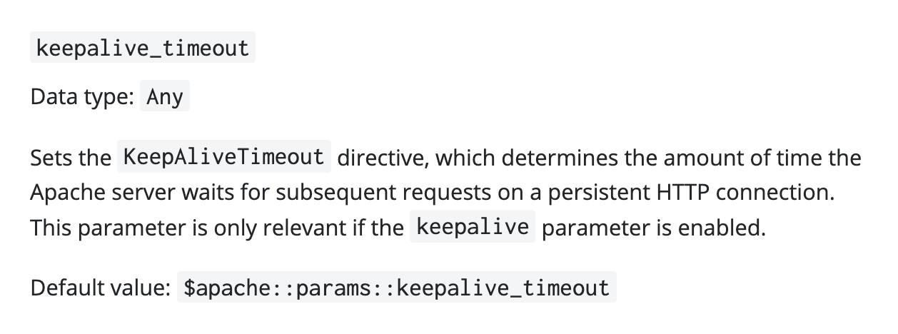

</div>


### Default values<a href="#default-values" aria-hidden="true"></a>

The default value for the `keepalive_timeout` parameter is shown as:

<div class="noninteractive">

```puppet
$apache::params::keepalive_timeout
```

</div>


Reviewing the Puppet namespacing scheme, **MODULENAME::MANIFESTNAME** this is telling us that the default value for the `keepalive_timeout` parameter is located in the apache module within the `params.pp` class:

`/etc/puppetlabs/code/environments/production/`:

<div class="noninteractive">

```
├─ modules/
   └─ apache/              <- Apache module
      └─ manifests/
         └─ params.pp      <- apache::params class
```
</div>

You can also navigate to the project url, at the top of most module pages to check out this class or any other aspects of the module directly. <a href="https://github.com/puppetlabs/puppetlabs-apache/blob/main/manifests/params.pp#L106" target="_blank">Here</a> is a link directly to the line within the `apache::params` class where the default value is specified for the `keepalive_timeout` parameter. 

### Adding additional parameters<a href="#adding-additional-parameters" aria-hidden="true"></a>

If you want to add this parameter and a custom value to our manifest, we can do this fairly simply:


```puppet
class profile::apache_web {
  class { 'apache':
    default_vhost => false,
  }
  apache::vhost { 'nix3.home':
    port               => '80',
    docroot            => '/var/www/nix3.home',
    keepalive_timeout  => '120',
  }
}
```

In summary, some common/basic usage examples are shown in the module readme and can help you get started pretty quickly. In many cases though, it’s not an exhaustive list of everything a module can do. For a full list of all parameters available for a given resource, class, defined type etc, you’ll most likely need to check out the Reference section.

> Not every module has a Reference tab, this is sometimes because _all_ of the documentation is presented in the module readme or the module is so simplistic that it doesn’t require a lot of documentation; i.e. the usage examples are all you need to understand in order to use the module. This can be seen more often in community created modules rather than modules created by Puppet or it’s partners.

## Applying configuration<a href="#applying-configuration" aria-hidden="true"></a>

Once you’ve created a profile or role and pushed it to your Control Repo, it should be available on the Puppet Server within a few seconds. This will happen automatically if the Puppet Server is set to sync with source control each time there’s a commit to the Control Repo, Alternatively, you’ll need to run `puppet-code deploy --all --wait` directly on the Puppet Server to pull the newest version of the Control Repo. 

You can then navigate to **Node groups** and click on your target node group. Navigate to the **Classes** tab.

Type the name of the class under **Add new class**, choose your class (`profile::apache_web`) and then click **Add class** then **Commit 1 change**.

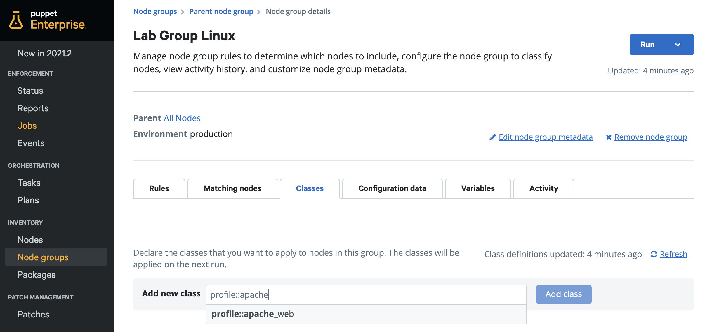

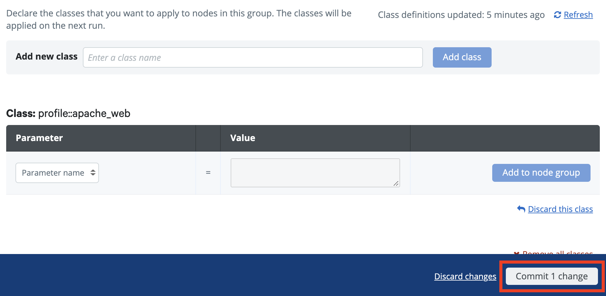

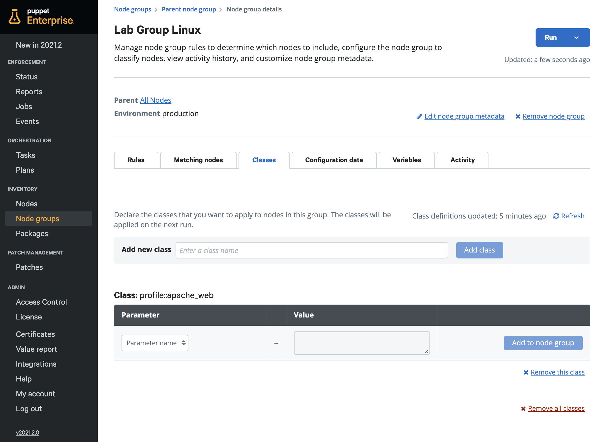

> If your class doesn’t appear, you may need to click **Refresh** to pick up the latest class definitions.

Now that your configuration has been added to your node, it’s time to apply it. From your node group, in the top right corner, click **Run > Puppet** then **Run job**.


<div class="size20margin">

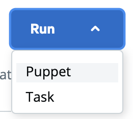

</div>

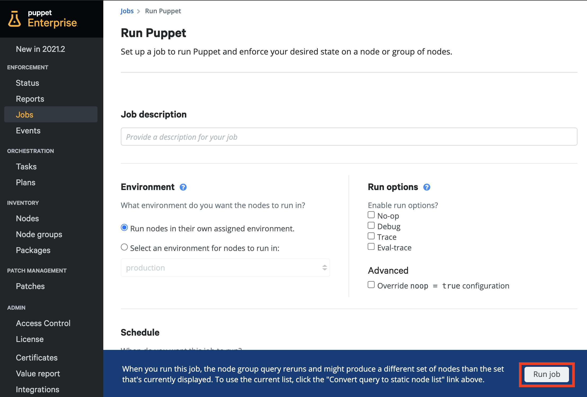

## Reviewing Reports<a href="#reviewing-reports" aria-hidden="true"></a>

After the Puppet run is complete, you should now see that you have Intentional changes (or corrective changes) with no errors, this means that your configuration has been successfully applied. 

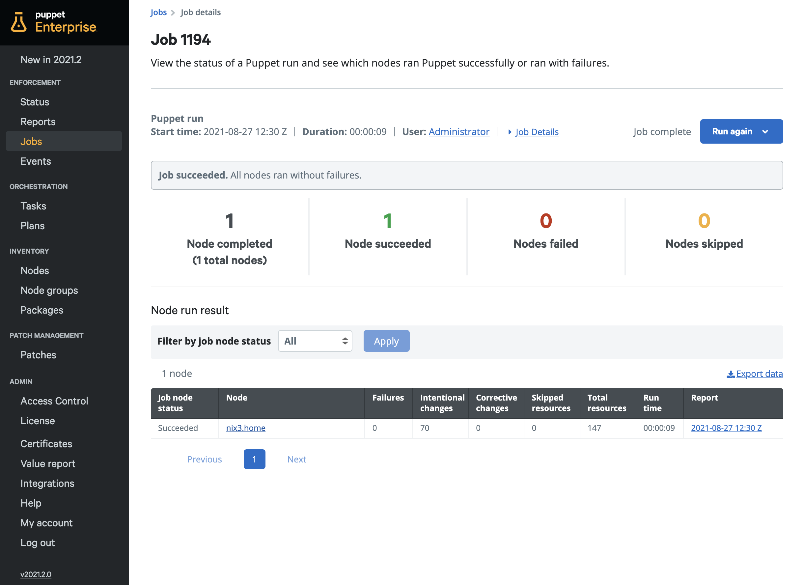

Click on the date and time of the report to navigate directly to it for further details. From there you can easily choose **Intentional change** from the **Filter by event status** dropdown to check the specific resources with changes on this Puppet run as well as any other event status such as **Corrective change** or **Failure**. 

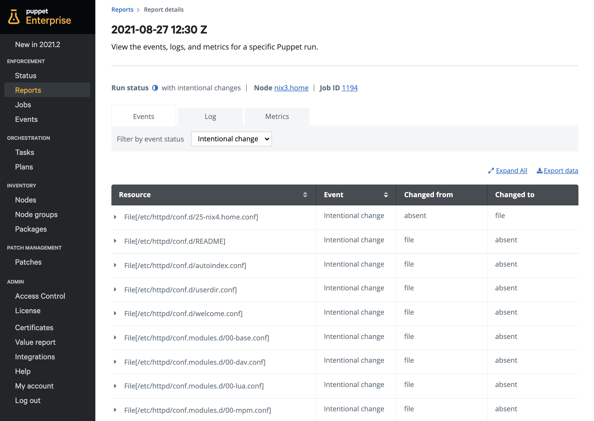


# Troubleshooting<a href="#troubleshooting" aria-hidden="true"></a>

If you're having issues with your desired state configurations, check out <a href="https://puppet-enterprise-guide.com/theory/defining-state-in-code.html#troubleshooting" target="_blank">the troubleshooting section</a> of the Defining State in Code page.