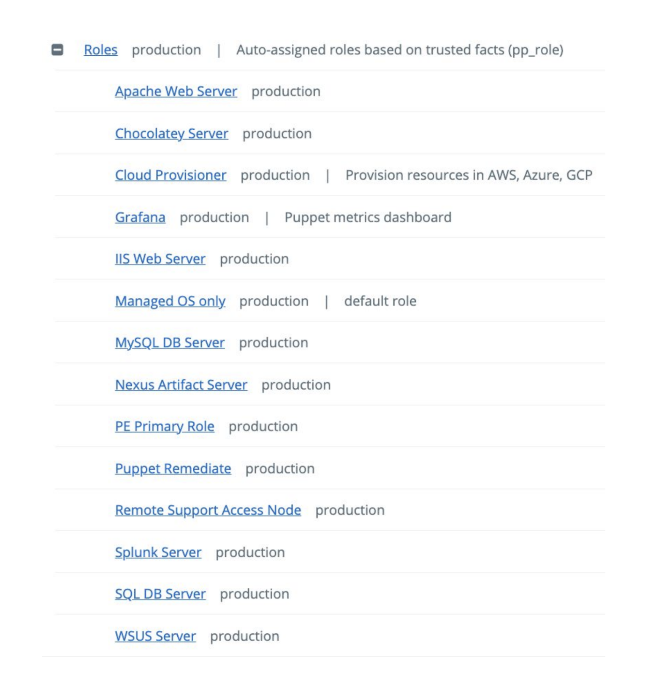
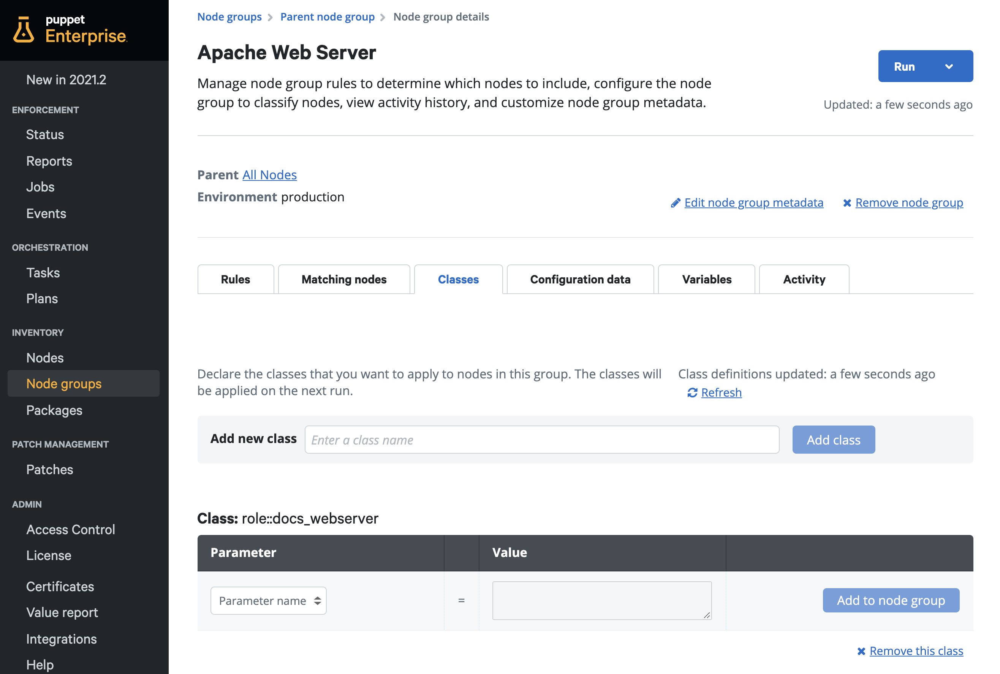
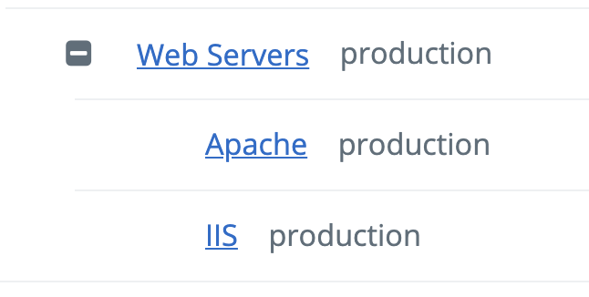
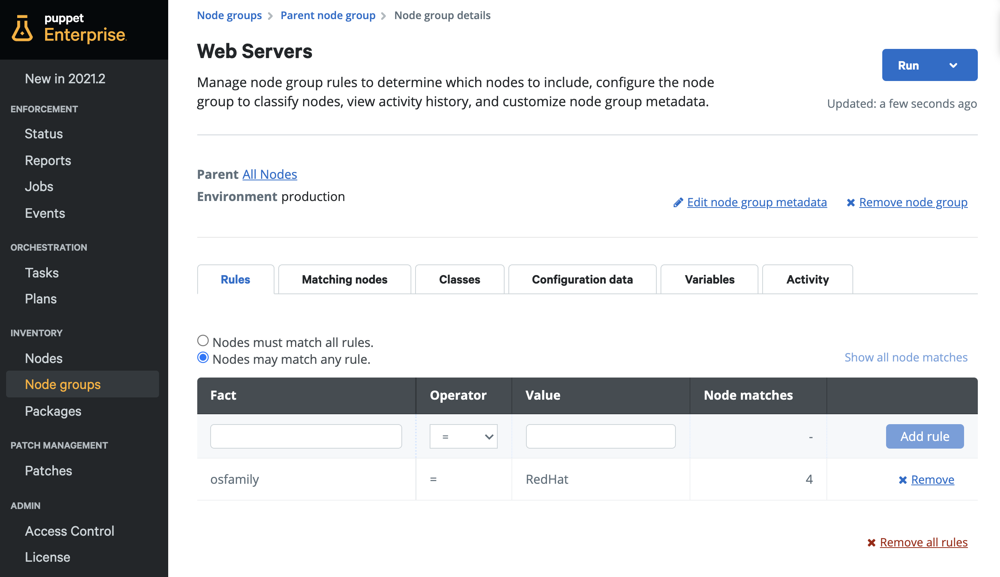
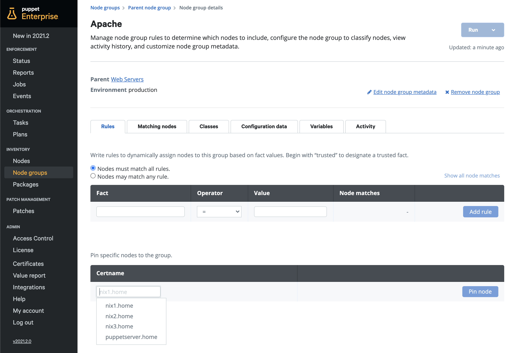

### Table of Contents

- [Overview](#overview)
- [How do they Work?](#how-node-groups-work)
  - [Node Group Best Practice](#node-group-best-practice)
  - [Node Group Inheritance](#node-group-inheritance)
  - [Environment Groups](#environment-groups)
  - [RBAC with Node groups](#rbac-with-node-groups)
- [Create a Node group](#create-a-node-group)
  - [Create a nested Node Group](#create-a-nested-node-group)
- [Add configurations to Node groups](#add-configurations-to-node-groups)
- [Add nodes to Node groups](#add-nodes-to-node-groups)
    - [Manually](#manually)
    - [Dynamically](#dynamically)

# Overview 
Node groups allow for nodes to be grouped together by business or infrastructure function in order to apply configurations or execute tasks against these specific groups of nodes. 

# How do they work? 

## Node Group Best Practice 

It’s recommended to go wide rather than deep with node groups, so avoid deeply nested groups and keep the hierarchy fairly flat overall.

If you’re using the Roles & Profiles pattern properly, almost every system in your infrastructure will match to a single Role. You can then create a node group for each role, for example:

**Example: Apache Web Server Node group - role **

Nodes within a small subset of similarly configured nodes that need slightly different configuration parameters should be handled via Hiera. We’ll go through <a href="https://puppet-enterprise-guide.com/theory/hiera-overview.html" target="_blank">Hiera</a> in more detail in the Going Further section of this guide.

## Node Group Inheritance  

Node groups have some inheritance capabilities. The parent group determines what nodes are eligible to be a member of any of its subgroups. For example, if you create a group with the rule `osfamily = RedHat`, then any subgroups of that group will only see RedHat nodes as possible members.

**Example: Web Server Parent and Child Node groups**

**Example: Web Server Parent Node group Members**

**Example: Available candidates from Sub Node Group**

> For PE to enforce any class or configuration data setting, the node group must explicitly define which nodes are a member of it. Inheritance doesn’t automatically make nodes a member of subgroups, it only makes them possible candidates. 

## Environment groups
Let’s start by explaining the difference between Environment groups and standard groups. 

* **Standard groups** are used for classifying code and don’t carry any badges. You make nodes a member of the group and then any code specified in the Classes tab will get assigned to these nodes. Technically these groups do allow you to specify the Environment setting, but this only affects which Puppet classes are visible in the Classes tab for assignment, it does NOT have any effect on the code environment the node is in. If you’re following best practices, you should ignore the environment setting for groups of this kind and leave them at their default of production. 

* **Environment groups** are identified by the `Env` group badge. They should only be used to control which code environment a node belongs to, nothing else. Technically these groups do have Classes and Configuration Data tabs, but the fact that those are visible is more of a limitation of that PE user interface than anything else; you shouldn’t use them for groups of this kind. 

In many cases, people equate the Puppet code environments with operational IT environments like development, testing, acceptance and production, However, this is a common misconception. You shouldn’t use separate code environments to control the differences in configuration between these different environments. These Puppet code environments should only be used to manage the testing of puppet code, regardless of operational environment. If you’re following best practice, the Puppet code in all code environments will be identical during periods of steady state and you'll use <a href="https://puppet-enterprise-guide.com/theory/hiera-overview.html" target="_blank">Hiera</a> to manage differences between your own operational environments such as development, testing and production systems. 

To learn more about how to use environment groups for Puppet code environment based testing, check out <a href="https://puppet.com/docs/pe/latest/environment_based_testing.html#environment_based_testing" target="_blank">this section</a> of the PE docs.

## RBAC with Node groups 

You can use Role Based access control (RBAC) in Puppet Enterprise to further delegate administrative ownership to other departments. 

For example, you can delegate the permission to add/remove nodes to a group, so that other departments can classify a node to a particular role by themselves. Alternatively, you can also create subgroups below the main role group, and use the _Configuration Data_ tab in the subgroup to allow control of Hiera variables directly from the PE web console. If this is again delegated through RBAC, other departments can use a role and customize the role’s behavior without ever needing to make a code change.

You can find out more about both of the topics discussed above by navigating to their respective sections within the guide - <a href="https://puppet-enterprise-guide.com/theory/using-role-based-access-control.html" target="_blank">Using Role based access control</a> and <a href="https://puppet-enterprise-guide.com/theory/hiera-overview.html" target="_blank">Hiera overview</a>.

# Create a Node group 

It’s possible to create node groups with subgroups. That said, node group hierarchy should remain fairly shallow i.e. a parent group with a few subgroups. Check out [Node group best practice](#node-group-best-practice) for more information on how best to structure node groups.

1. Navigate to the **Node groups** page and click on your node group.
2. Click the **Add group** dropdown and enter the following details:

    | Parent name       | Group Name     |  Environment        | Description |
    | -----------       | -----------     |-----------         |-----------  |
    | All Nodes     | *(Name of your node group)*      | production      | *(Description of your node group)*                |

3. Click **Add**.

## Create a nested Node Group 

1. Navigate to the **Node groups** page and click on your node group.
2. Click the **Add group** dropdown and enter the following details:

    | Parent name       | Group Name     |  Environment        | Description |
    | -----------       | -----------     |-----------         |-----------  |
    | *(Your parent group)*     | *(Name of your child node group)*      | production      | *(Description of your node group)*                |

3. Click **Add**.

# Add configurations to Node groups 

1. Navigate to the **Node groups** page and click on your node group.
2. Click on the **Classes** tab.
3. To the right of **Add new class**, click on the text box labeled **Enter a class name**.
4. Type the name of class or scroll the list and then click on your class.
5. Click **Add class**.
6. Click **Commit 1 change**.

# Add nodes to Node groups 

## Manually 

1. Navigate to the **Node groups** page and click on your node group.
2. From the **Rules** tab, under the “Pin specific nodes to the group” section, enter the name of your node, select it and then click **Pin node**.
3. Click **Commit 1 change**.

## Dynamically 

You can automatically and dynamically make nodes members of your desired node groups by using *rules* based on facts. Facts are pieces of system information gathered automatically when the puppet agent runs on your nodes. This means you can do things like automatically define node group membership based on their operating system platform or IP range. Rules therefore make it really easy to automatically onboard nodes in Puppet Enterprise with the correct configurations applied based on their rule values (if configurations are already assigned to the node group).

1. Click on your node group from the **Node group** page.
2. From the **Rules** tab, you can specify which facts you would like to assign nodes by. You can choose to either have **Nodes must match all rules** or **Nodes may match any rule** in order to become part of the node group.
3. Under **fact** you can select the fact that you want to assign nodes by. Once chosen, you can input the expected value in order to trigger this rule - (see [Rule Examples](#rule-examples) below) 
4. Once you’ve chosen your desired criteria, click **Add rule**.
   You can continue to add more than one rule, if required. 
5. **Commit 1 change.**

### Rule Examples 

#### RedHat Servers 

  | Fact       | Operator     |  Value        | 
  | --------   | --------     |--------        |
  | osfamily     | =      | RedHat |

#### Servers running Windows Server 2019 

  | Fact       | Operator     |  Value        | 
  | --------   | --------     |--------        |
  | osfamily     | =      | windows |
  | os.release.major    | =      | 2019 |

> Fact values are case sensitive so ensure you use the correct case for a given fact. For example, for the `osfamily` fact, "windows" is all lowercase. This means that the fact value "Windows" won't return any results.

**Example: Web Servers dynamic membership rules**

When using these dynamic rules, you’re leveraging Puppet’s built-in facts which are useful to group and query nodes. Using your own custom facts can make this functionality even more powerful, however this is something we’ll cover in the Going Further section of this guide.

### Dynamic rule operators 

We used the default operator (=) in this example which simply checks whether the fact value for a node is a specific value but you can leverage other operators in your rules. Here is a quick cheat sheet for operator functions:

  | Operator       | Description     |
  | --------       |--------                                     |
  | =     | Checks if the values of two operands are equal or not, if yes then the condition becomes true.                                                      | 
  | !=    | Checks if the values of two operands are equal or not, if values are not equal then the condition becomes true.                                                     | 
  | >     | Checks if the value of the left operand is greater than the value of the right operand, if yes then the condition becomes true.                                                     | 
  | <     |Checks if the value of the left operand is less than the value of the right operand, if yes then the condition becomes true.                                                     | 
  | >=    | Checks if the value of the left operand is greater than or equal to the value of the right operand, if yes then the condition becomes true.                                                     | 
  | <=    | Checks if the value of the left operand is less than or equal to the value of the right operand, if yes then the condition becomes true.                                                     | 
  | ~     | Checks if the value of the left operand matches against the regular expression as defined in the value of the right operand, if yes then the condition becomes true.                                                     | 
  | !~    | Checks if the value of the left operand matches against the regular expression as defined in the value of the right operand, if there is no match then the condition becomes true.                                                     | 
