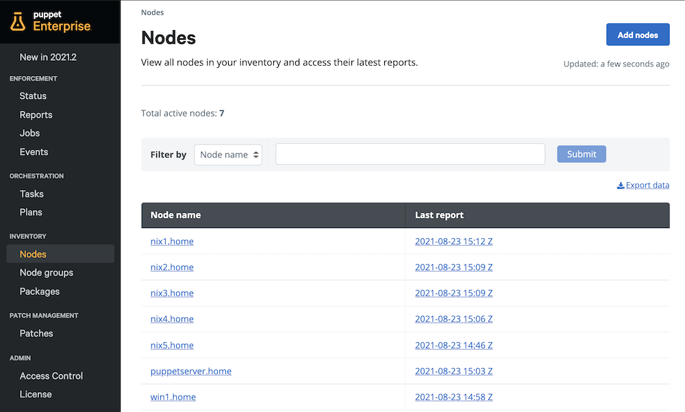
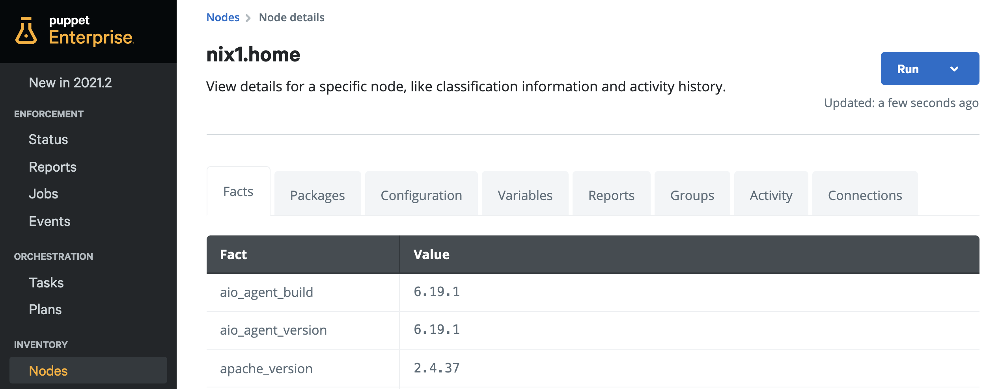

### Table of Contents

- [Overview](#overview)
  - [Agent based nodes](#agent-based-nodes)
    - [Authentication and communication](#authentication-and-communication)
    - [TLS](#tls)
  - [Agentless nodes](#agentless-nodes)
- [Inspecting Node Inventory](#inspecting-node-inventory)
    - [Facts](#facts)
    - [Packages](#packages)
    - [Configuration](#configuration)
    - [Reports](#reports)
    - [Groups](#groups)
    - [Activity](#activity)
- [Add Nodes to inventory](#add-nodes-to-inventory)
  - [Add Agent nodes](#add-agent-nodes)
    - [Download agent package(s)](#download-agent-packages)
    - [Common platform examples](#common-platform-examples)
    - [Understanding the results of the Puppet Run](#understanding-the-results-of-the-puppet-run)
    - [Install agent package](#install-agent-package)
    - [Approve certificate(s)](#approve-certificates)
  - [Add Agentless Nodes](#add-agentless-nodes)

# Overview

In Puppet Enterprise, you manage both agent based and agentless nodes. You can find these an inventory of these nodes are listed in the sidebar in the **Nodes** page found under the Inventory section in the sidebar of the the PE console. 

## Agent based nodes
Agent based nodes can make use of both ad-hoc (task and plans) as well as desired state configurations.

### Authentication and communication

Once the agent is installed, a certificate is generated on the agent node. This certificate is then used for authentication between the Puppet agent and the Primary server. Certificates need to be approved by the Primary Puppet server before the node can be added. Once the certificate is approved in the PE console, the agent node is authenticated and uses its client certificate to securely communicate with the Primary Puppet server. This means that it doesn't require user credentials to interact with target nodes. 

Communication takes place over the Puppet Communications Protocol (PCP) via ports **8142** and **8140**.

### TLS

Transport Layer security (TLS) v1.2 is leveraged within Puppet Enterprise for communication safety and encryption. Puppet Enterprise complies with up to date security regulations and as such, the older TLSv1 and TLSv1.1 protocols are disabled by default. 

If you’re experiencing issues with authentication/communication in the next few steps, it may be worth checking which TLS version your target nodes are using. If you need to enable TLSv1 or 1.1, you can find information on how to do that <a href="https://puppet.com/docs/pe/latest/enable_tlsv1.html" target="_blank">here</a>.

## Agentless nodes
Whilst the agent-based approach allows for both desired state and ad-hoc automation without the need for local credentials on the node, there may be instances where installing an agent may not be possible or desired. This is where a purely agentless approach is best suited. You can connect to nodes agentlessly via either WinRM or SSH. 

> There are some limitations on what you can do with agentless nodes. You cannot use desired state enforcement with agentless nodes, but you can run Tasks and Plans.

# Inspecting Node Inventory

You can navigate to **Nodes** from the PE sidebar to view all of your nodes in Inventory. From here, you can search for nodes and find more detailed information about a node, it's configuration, system information and more by simply clicking on it. 

When you navigate to a node entry, you will find several tabs with information contained in each.

### Facts

The Puppet agent leverages a built-in tool named facter to gather key system information like memory capacity/use, disk size/space, domain, ipaddress, operating system and much more. These individual pieces of system information are called facts. They are gathered each time a Puppet agent run occurs (default 30 mins). It’s also possible to add your own custom facts to gather information that’s important to you and your organisation. Facts can also be used to automatically determine which configurations a node should receive, but we’ll cover this in greater detail in the going further section of this guide.

### Packages

Puppet can pull package information on nodes across your estate. The packages tab gives a view of packages installed on the selected node, rather than all nodes shown in **Packages** page within the sidebar.

### Configuration

You can find which configurations are currently applied to your node and where those configurations are coming from based on your nodes group membership.

### Reports

You will find all of the reports that this node has submitted regarding its desired state enforcement activity. You can navigate to any report by clicking on the date/time to view specifics on changes that may have taken place.

### Groups

The groups tab shows all of the groups that your node is a member of. This includes group and parent group information as well as environment. You can find more information about standard groups and environment groups <a href="https://puppet-enterprise-guide.com/theory/node-groups.html#environment-groups" target="_blank">here</a>.

### Activity

Displays a history of actions taken against a given node. It will display information related to any actions a user has taken, this can be anything from adding a node to a node group, running a Puppet task or a Puppet enforcement run. Along with the specific action a user has taken, it will also display the time this action occured and which user performed the action.

# Add Nodes to inventory

1. Under the **Inventory** heading in the sidebar within the PE console, click **Nodes** and then on the top right, click **Add nodes.** 

You have now 3 different options when it comes to adding inventory:

* Installing agents on nodes
* Connecting nodes agentlessly over SSH or WinRM
* Connect supported network devices agentlessly (requires modules from the Puppet Forge)

This guide mainly focuses on adding Installing agents on nodes and adding nodes agentlessly.

In the **Add Agent nodes** method described below, the Puppet server hosts the Puppet agent installation package and target nodes download the install package locally from the Puppet server. This is generally the easiest way to onboard agent nodes. However, there are several other ways to install the Puppet agent and pair with the Primary Puppet server. 

If you want more information on other installation methods, we'd recommend you check out the <a href="https://puppet.com/docs/pe/latest/installing_agents.html" target="_blank">this section</a> of the Puppet Docs.

## Add Agent nodes

### Download agent package(s)

In order for target nodes to download the Puppet agent package from the Puppet server, the Puppet server first must have the agent packages stored locally. 

As standard the Puppet server will already have the agent package for the platform that is currently installed. For example if your Primary Puppet server is installed on CentOS 7, it will already have agent packages for that platform. Windows agents are also available as standard on the Primary Puppet server for the x86_64 architecture. 

1. You can add additional agent packages by navigating to **Node Groups**.

2. Expand the **PE infrastructure** by clicking the **⊞** sign, then click the **PE Master** node group.

3. Navigate to the **Classes** tab.

4. Under **Add new class,** enter the corresponding class name for each target agent platform (see [common-platform-examples](#common-platform-examples) below)

5. Once you’ve selected your relevant class, click **Add class**.

6. When you’re done, click **Commit 1 Change**.

    You’ll now need to perform a Puppet run on the primary Puppet server in order for the agent package to be downloaded. 

7. Ensure you are still within the **PE Master** node group and click **Run > Puppet** in the top right of the page and then **Run job**. 

### Common platform examples

| Operating System              | Agent package classes                   |
| -----------                   | -----------                             |
| CentOS/RHEL/Oracle 7          | pe_repo::platform::el_7_x86_64    |
| CentOS/RHEL/Oracle 8          | pe_repo::platform::el_8_x86_64    |
| Debian 9                      | pe_repo::platform::debian_9_amd64    |
| Debian 10                     | pe_repo::platform::debian_10_amd64    |
| Ubuntu 18.04                  | pe_repo::platform::ubuntu_1804_amd64    |
| Ubuntu 20.04                  | pe_repo::platform::ubuntu_2004_amd64    |
| SLES 15                       | pe_repo::platform::sles_15_x86_64   |
| Windows 32 bit                | pe_repo::platform::windows_i386    |
| Windows 64 bit                | pe_repo::platform::windows_x86_64    |

### Understanding the results of the Puppet Run

We've essentially just used Puppet to configure....well, Puppet. So, what exactly took place? 

Once the run is complete, you should find that you have a few intentional changes. These changes will include downloading relevant agent packages and associated installation scripts. If you click on the date and time of the report from the job run page, for example 2021-06-10 10:07 Z and then choose **Filter by event status** - **Intentional Change** you should be presented with all of the **Intentional changes** that took place on that Puppet run. The intentional changes will include both **File** and **Exec** resources.

The **File** resources are the relevant Puppet agent installation files and the **Exec** resources are ensuring that the installation files are extracted and placed in a newly created directory where PE can easily serve up these files to any target nodes. 

The agent installation package should now be available and ready to be distributed to nodes. 

### Install agent package

**SSH / WinRM**

You can easily install the Puppet agent on your target nodes via SSH/WinRM. This method allows you to “push” the Puppet agent without manually logging into your target nodes, which can be useful when onboarding a large number of nodes. 

The Primary Puppet server will reach out to your target nodes via SSH/WinRM and the target node will download the Puppet agent install script from the Puppet server and then execute it locally on the target. The agent install script will then download and install the Puppet agent from the Puppet server. Once downloaded, the agent is installed and a certificate request is sent to the Puppet server for approval.

> SSH or WinRM needs to be enabled on the target system and any local firewall on the target system needs to allow incoming connections to that protocol’s port. 

1. Navigate to **Nodes** > **Add Nodes** > **Install agents** and simply add your credentials for your chosen target transport method and click **Add nodes**. 
2. You can click on **“Installation Job Started”** to view the progress of the agent installation.

**Command Line**

You can also install the Puppet agent via the command line. With the command line method, you will need to login to the nodes and run the command manually on each. The command line option can be particularly useful when building the Puppet agent installation process in existing provisioning workflows.

When you run the install command directly on your target, it will first reach out to the primary server to download and install the Puppet agent from the primary Puppet server. Once the agent is installed, a certificate request is sent to the Puppet server for approval. 

1. Copy the agent install command from the **Install agents** page - found within **Nodes** > **Add Nodes** > **Install agents** > **Manual installation**.
2. Execute the install command on your target node's shell.

### Approve certificate(s)

Once the Puppet agent is successfully installed via one of the methods described above, you can then accept the certificate request within the PE console. 

1. You can find certificates that are pending approval by navigating to the **Certificates** page > **Unsigned certificates** tab and click **accept** on your relevant node certificate request.

> After a certificate is approved, you _may_ need to run Puppet directly on the target node. Alternatively, you can wait until your nodes scheduled Puppet run to occur (default 30 minutes). Once the first Puppet run is complete after certificate signing, your node will then appear in the Puppet console.

2. If neccessary, run the command **puppet agent -t** from your shell - bash for nix, command prompt on Windows.

For more advanced use, you can also have Puppet automatically approve the certificates using either simple or more complex logic, as described <a href="https://puppet.com/docs/puppet/latest/ssl_autosign.html" target="_blank">here</a>.

## Add Agentless Nodes

1. Under **Inventory** in the sidebar within the PE console, click **Nodes** and then click **Add nodes.** Click the **Connect over SSH or WinRM** button. 
2. Choose your transport method (SSH or WinRM) and populate the relevant fields with your credential information. Once complete, ensure that the **Test Connections** checkbox is ticked. This ensures that node connectivity is verified before adding to inventory. If a connection fails, your nodes won’t be added.