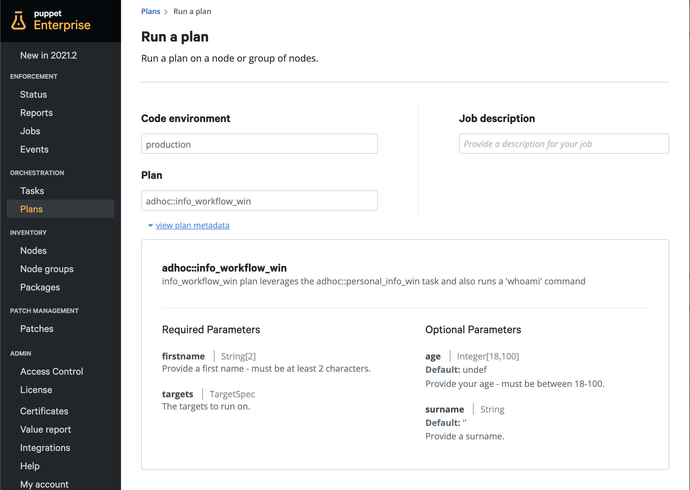
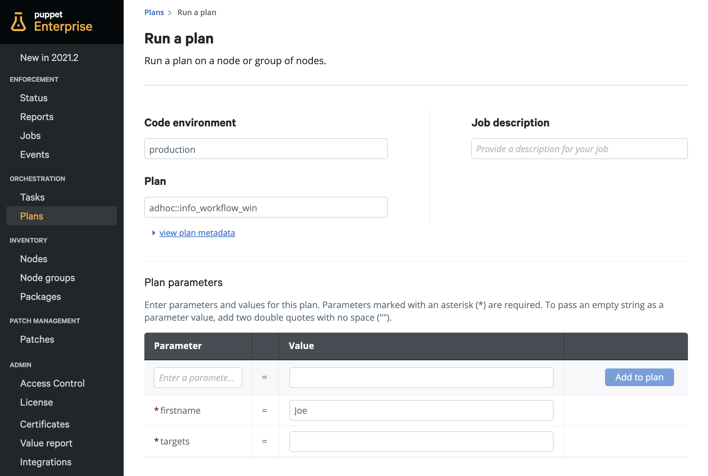
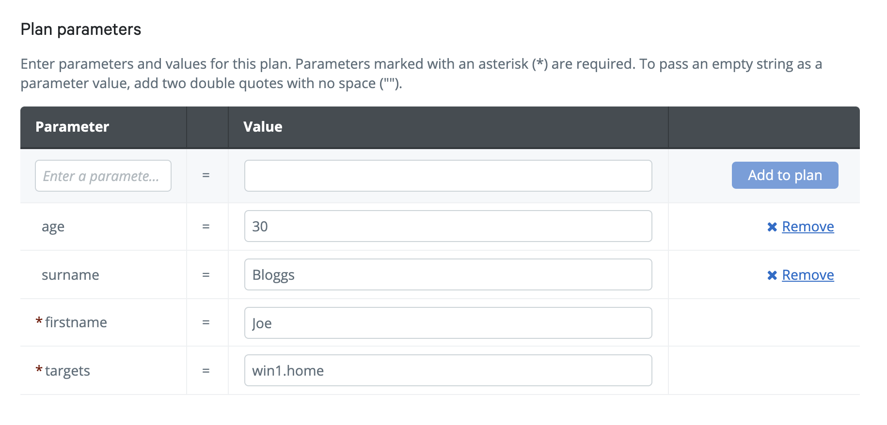
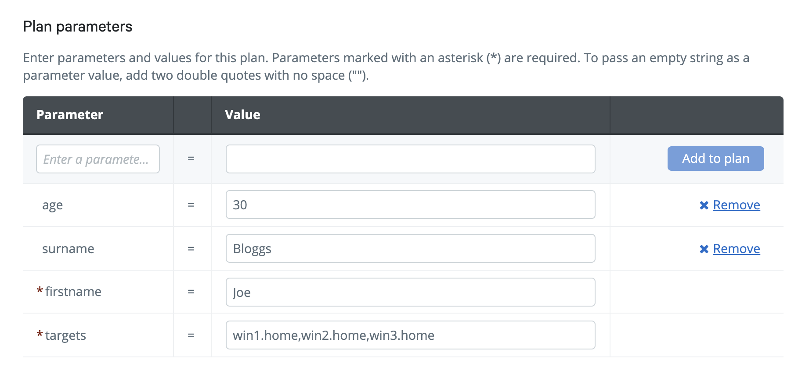
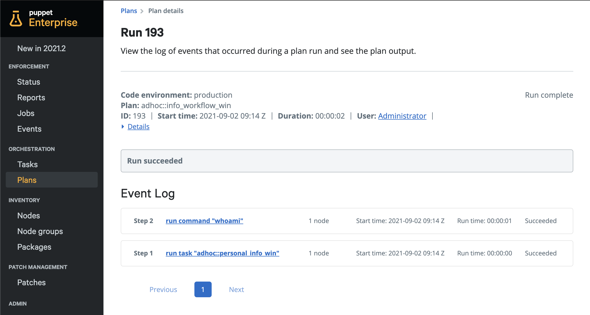
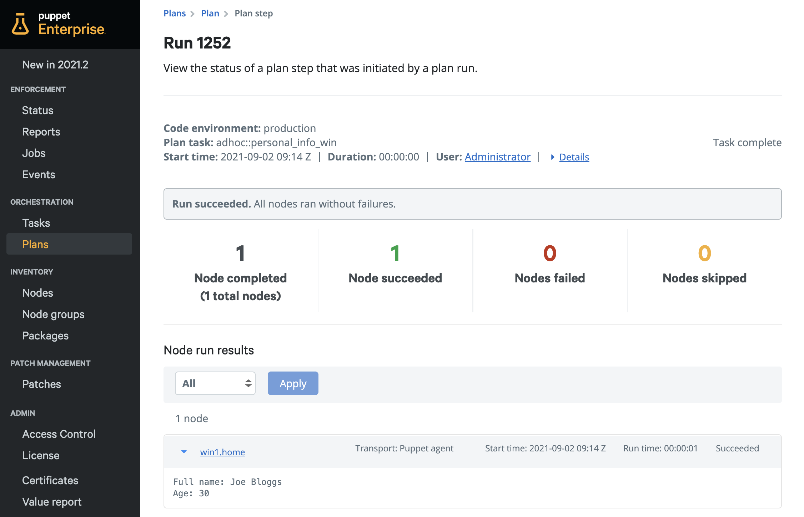
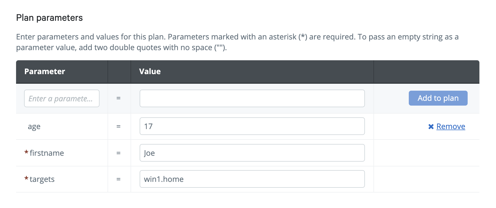
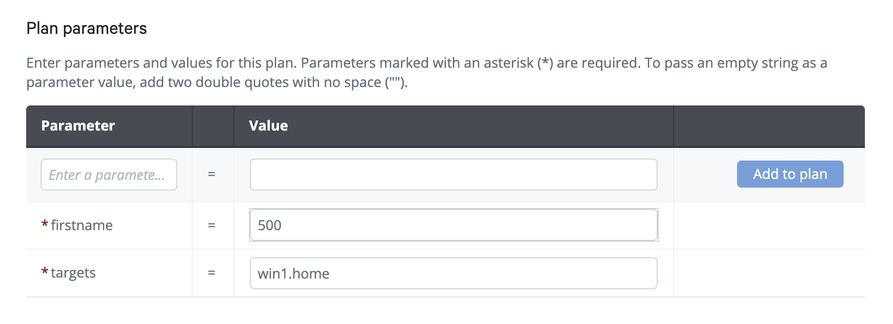
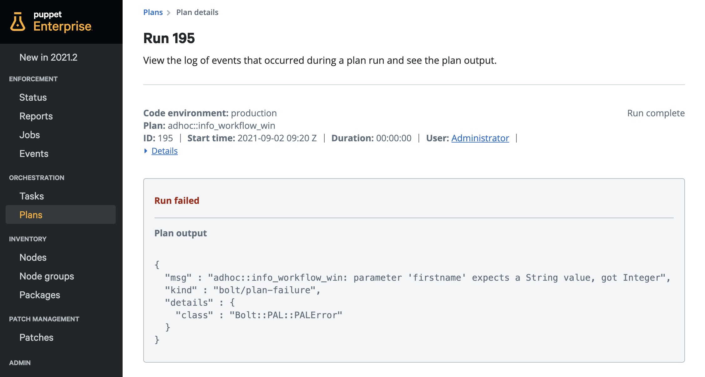

<div class="tocoutline">

### Table of Contents

<div class="toc">

- [Prerequisites](#prerequisites)
- [Creating a Plan Manifest in the Control Repo](#creating-plan-manifest-in-the-control-repo)
- [Plan Definition](#plan-definition)
- [Adding Parameters](#adding-parameters)
- [Plan steps](#plan-steps)
  - [run_task function](#run_task-function)
  - [Adding run_task function to Plan](#adding-run_task-function-to-plan)
  - [Adding run_task parameters](#adding-run_task-parameters)
  - [run_command function](#run_command-function)
  - [Adding run_command function to Plan](#adding-run_command-function-to-plan)
- [Adding Metadata to Plan](#adding-metadata-to-plan)
- [Deploying configurations](#deploying-configurations)
- [Running Plans in PE](#running-plans-in-pe)
  - [Specifying Targets](#specifying-targets)
  - [Running your Plan and reviewing results](#running-your-plan-and-reviewing-results)
  - [Parameter enforcement](#parameter-enforcement)
- [Summary](#summary)

</div>

</div>

## Prerequisites<a href="#prerequisites" aria-hidden="true"></a>

This plan requires and makes use of the `adhoc::personal_info_win` task found in <a href="https://puppet-enterprise-guide.com/theory/task-example.html" target="_blank">Task Example Walkthrough</a>.

## Creating a Plan Manifest in the Control Repo<a href="#creating-a-plan-manifest-in-the-control-repo" aria-hidden="true"></a>

We’ll start off by creating the plan manifest.

**Plan filename**: `info_workflow_win.pp`

As we’re using the Puppet Template Control Repo, we can create the Plan within the **plans** directory of the **adhoc** module.

<div class="noninteractive">

```
├─ controlrepo/
    └─ site-modules/
        └─ adhoc/					
            ├─ tasks/
            │  └─ personal_info_win.ps1		
            │  └─ personal_info_win.json	
            └─ plans/
                └─info_workflow_win.pp		
```
</div>

## Plan Definition<a href="#plan-definition" aria-hidden="true"></a>

In order for Puppet Enterprise to recognise this manifest as a valid Plan, <span style="text-decoration:underline;">the name of the Plan must be accurately defined at the top of the manifest.</span> 

Plans are automatically namespaced as **MODULENAME::PLANNAME**. The **adhoc** directory is a module so this means that our Plan example show above will be namespaced as:

**adhoc::info_workflow_win**

Within the `info_workflow_win.pp` manifest, the Plan name at the top must correspond to this naming convention described above:


```puppet
plan adhoc::info_workflow_win {
}
```


## Adding Parameters<a href="#adding-parameters" aria-hidden="true"></a>

Just like Tasks, we can specify required and optional parameters with validation. 

In this plan, we are specifying 4 parameters:

* 2 required:  `$targets`, `$firstname`

* 2 optional: `$surname`, `$age`

First off, we’ll specify a `$targets` parameter for the Plan which will allow users to specify one target set for the various steps in the Plan.


```puppet
plan adhoc::info_workflow_win(
  TargetSpec $targets,
) {
}
```

> When adding parameters to Plans, you'll need open parenthesis after the Plan name/definition and close them after your last parameter.

Next we’ll add the 3 other parameters which are required for our task that we’ll run as part of the Plan.


```puppet
plan adhoc::info_workflow_win(
  TargetSpec $targets,
  String[2] $firstname,
  Optional[Integer[18,100]] $age = undef,
  Optional[String] $surname = ''
) {
}
```


Parameter data types and restrictions are specified to the left of parameters.

Notice that the `$firstname` parameter has a requirement of a string of at least 2 characters. 

The `$age` parameter, whilst not mandatory like `$firstname`, still has data input requirements. If you choose to specify a value for age, it must be an integer between 18 to 100. We need to set the default value to `undef` which results in `$age` becoming a null value, if it doesn't recieve an input. The null value means we need to either change the Task/script content or accommodate for this within Plan. In this case, we'll use some conditional logic in the Plan to handle it, rather than changing the underlying Task.

The `$surname` parameter is also optional but requires a string input - to avoid the null value described above, it currently has an assignment to an empty string.

These data types and restrictions are inline with the parameters defined in the Task Metadata for the `adhoc::personal_info_win` Task.

## Plan steps<a href="#plan-steps" aria-hidden="true"></a>

We’re going to need two steps/functions in this Plan:

1. The `run_task` function with the `adhoc::personal_info_win` task.

2. The `run_command` function.

### run_task function<a href="#run_task-function" aria-hidden="true"></a>

The basic syntax for the `run_task` function is as follows:

<div class="noninteractive">

```puppet
run_task('mytask::name', $targets)
```
</div>

If you’re specifying parameters to the Task, the syntax is as follows:

<div class="noninteractive">

```puppet
run_task('mytask::name', $targets, {
    'taskparam1' => 'value',
    'taskparam2' => 'value'
  })
```
</div>

### Adding run_task function to Plan<a href="#adding-run_task-function-to-plan" aria-hidden="true"></a>

We can add the <a href="https://puppet.com/docs/bolt/latest/plan_functions.html#run-task" target="_blank">`run_task`</a> function and specify our desired Task and targets; however, in this case, our Task requires parameters in order to run successfully. 

If we wanted to simply add the `run_task` function _without_ parameters, it would look like this:


```puppet
plan adhoc::info_workflow_win(
  TargetSpec $targets,
  String[2] $firstname,
  Optional[Integer[18,100]] $age = undef,
  Optional[String] $surname = ''
) {

  run_task('adhoc::personal_info_win', $targets)
}
```

### Adding run_task parameters<a href="#adding-run_task-parameters" aria-hidden="true"></a>

Whilst we’ve specified Plan parameters at the top of the Plan, they currently aren’t linked to an action within the Plan. We want to assign those Plan parameters to our Task parameters. 

In this example, we’ll map the three Task parameters `firstname`, `surname` and `age`  from `adhoc::personal_info_win `to the equivalent Plan parameters `$firstname` `$surname` and `age`:


```puppet
plan adhoc::info_workflow_win(
  TargetSpec $targets,
  String[2] $firstname,
  Optional[Integer[18,100]] $age = undef,
  Optional[String] $surname = ''
) {

  run_task('adhoc::personal_info_win', $targets, {
    'firstname' => $firstname,
    'surname' => $surname,
    'age' => $age,
  })
}
```

We now need to apply our conditional logic for the age parameter mentioned in [Adding Parameters](#adding-parameters)

```puppet
plan adhoc::info_workflow_win(
  TargetSpec $targets,
  String[2] $firstname,
  Optional[Integer[18,100]] $age = undef,
  Optional[String] $surname = ''
) {

  if $age {
    run_task('adhoc::personal_info_win', $targets, {
      'firstname' => $firstname,
      'surname' => $surname,
      'age' => $age,
    })
  }
  else {
    run_task('adhoc::personal_info_win', $targets, {
      'firstname' => $firstname,
      'surname' => $surname,
    })
  }
}
```

Now our Plan users can pass the parameters shown above to the Plan which will then be passed to the Task and executed.

### run_command function<a href="#run_command-function" aria-hidden="true"></a>

The `run_command` function can run any command within a Plan. The syntax is fairly straight forward:

<div class="noninteractive">

```puppet
run_command('mycommand', $mytargets) 
```
</div>

### Adding run_command function to Plan<a href="#adding-run_command-function-to-plan" aria-hidden="true"></a>

In the `run_command` function we want to run a simple `whoami` command:


```puppet
plan adhoc::info_workflow_win(
  TargetSpec $targets,
  String[2] $firstname,
  Optional[Integer[18,100]] $age = undef,
  Optional[String] $surname = ''
) {

  if $age {
    run_task('adhoc::personal_info_win', $targets, {
      'firstname' => $firstname,
      'surname' => $surname,
      'age' => $age,
    })
  }
  else {
    run_task('adhoc::personal_info_win', $targets, {
      'firstname' => $firstname,
      'surname' => $surname,
    })
  }

  run_command('whoami', $targets)
 }
```


## Adding Metadata to Plan<a href="#adding-metadata-to-plan" aria-hidden="true"></a>

Now that we’ve added all of our parameters and Plan steps, it’s time to wrap up. We want to make this Plan as usable for folks as possible so they can easily understand what this Plan does and what parameters it accepts. 

Descriptions for a Plan and it’s parameters must be specified **above** the Plan name.

To add an overall description for the Plan, use the `@summary` string followed by a description. 

To add a description for each of the parameters in the Plan, we use the `@param` string followed by the name of the parameter and then it’s description:


```puppet
# @summary info_workflow_win plan leverages the adhoc::personal_info_win task and also runs a 'whoami' command
# @param targets The targets to run on.
# @param firstname Provide a first name - must be at least 2 characters.
# @param surname Provide a surname.
# @param age Provide your age - must be between 18-100.
plan adhoc::info_workflow_win(
  TargetSpec $targets,
  String[2] $firstname,
  Optional[Integer[18,100]] $age = undef,
  Optional[String] $surname = ''
) {

  if $age {
    run_task('adhoc::personal_info_win', $targets, {
      'firstname' => $firstname,
      'surname' => $surname,
      'age' => $age,
    })
  }
  else {
    run_task('adhoc::personal_info_win', $targets, {
      'firstname' => $firstname,
      'surname' => $surname,
    })
  }

  run_command('whoami', $targets)
 }
```


## Deploying configurations<a href="#deploying-configurations" aria-hidden="true"></a>

Once you’ve created your Plan and pushed it to your Control Repo, it should be available to run in the Puppet Console within a few seconds. This will happen automatically if the Puppet Server is set to sync with source control each time there’s a commit to the Control Repo, alternatively, you’ll need to run puppet-code deploy --all --wait directly on the Puppet Server to pull the newest version of the Control Repo. 

## Running plans in PE<a href="#running-plans-in-pe" aria-hidden="true"></a>

Once the Control Repo syncs with the Puppet Server, your Plan will be available in the Puppet console - From the sidebar under **Orchestration**, choose **Plans** then **Run a plan**.

Below you can find the `adhoc::personal_info_win` Plan and its associated Plan metadata. You can see the Plan description and as well the various parameters available to the Plan and whether they are **required** or **optional** and their associated descriptions.



Below the Plan metadata, you can specify the parameter values. Required parameters will be shown as default and marked with an asterisk.



To add optional parameter values, click _Enter a parameter name_, choose a parameter and then click **Add to Plan**. You can then input the parameter value and run the Plan on your target nodes.


### Specifying Targets<a href="#specifying-targets" aria-hidden="true"></a>

As default, Puppet plans will run directly on the Puppet Server however you can add a `$targets` variable to allow users to specify which target nodes to run the Plan on. Plans also differ from Tasks in that you can specify different targets for different steps in a given Plan. In our example, we’ve created a `$targets` variable to allow us to specify one or more targets. To do this, we simply enter the certname for our target:



If you want to run the Plan on multiple targets, you can simply comma separate targets like so: 



### Running your Plan and reviewing results<a href="#running-your-plan-and-reviewing-results" aria-hidden="true"></a>

When you’re ready, you can click **Run job** in the bottom right of the screen.

Once your Plan has successfully completed it’s run the event log will show all of the steps that have been completed during the Plan run. In this call we have two, the `run_task` and `run_command` step.



We can then click on the individual steps and view the output for each step across our targets. Here you can see the output for **Step 1 run task "adhoc::personal_info_win"**:





## Parameter enforcement<a href="#parameter-enforcement" aria-hidden="true"></a>
Parameter values are verified by the Puppet Server against the relevant Plan parameters contained within the Plan manifest. If you're using a Task within a Plan, the relevant Task Metadata will be used to verify any Task parameters before running the Plan. The Puppet Server will restrict Plan execution if any parameter inputs are invalid. Let's take a look at what parameter enforcement looks like in the context of this Plan.

### Example: Invalid parameter input 1

In the Task Metadata, the **age** parameter had a requirement of an optional integer between 18 - 100. In this example we purposely input "17".  This is verified by the Puppet Server before running the Plan and will restrict Plan execution as the parameter input is invalid.




### Example: Invalid parameter input 2

The **firstname** parameter is required and expects a string value. In this example we purposely input an Integer, "500".






## Summary<a href="#summary" aria-hidden="true"></a>

This was a simple example of how you can develop powerful orchestration flows that remain easily consumable to end users. Plans are a really powerful way to enable self service for other teams who don’t have Puppet/orchestration skills but would be a “consumer” of automation. 
