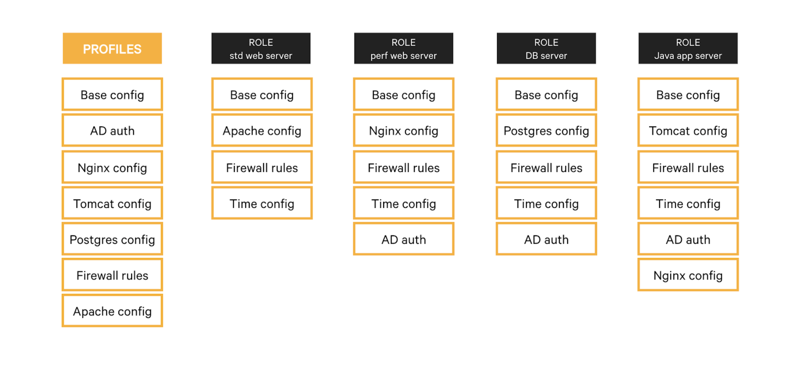

<div class="tocoutline">

### Table of Contents

<div class="toc">

- [Description](#description)
- [Why use them?](#why-use-them)
- [How do they work?](#how-do-they-work)
  - [Components](#components)
  - [Role and profile directories](#role-and-profile-directories)
- [Considerations when building roles and profiles](#considerations-when-building-roles-and-profiles)
- [Examples](#examples)

</div>

</div>

# Description<a href="#description" aria-hidden="true"></a>

Roles and profiles are a method for defining configurations in a practical and reusable way. Profiles are Puppet configurations that automate specific configuration items and contain logic and parameters to control behavior. Roles allow you to call one or more of those profiles, giving you a single configuration made up of multiple component configurations that you can easily assign to one or more servers.

Think of a role as a car made of lego, profiles as lego bricks and in this example the lego bricks consist of wheels, an engine, steering wheel, seats etc. When you put them all together, you get a fully functioning car (role). 

What if someday you decide that you want to build a truck? Great! You already have a lot of the building blocks (profiles) to make that possible. You’ve got a steering wheel and seats, that may require no modification whatsoever. You also have the building blocks for wheels and an engine which might not be suitable in their current form but they could be adapted for use within your truck (role) with fairly little effort, as most of the work is already done.

# Why use them?<a href="#why-use-them" aria-hidden="true"></a>

Roles and profiles make configurations reusable, shareable and maintainable. If your Puppet usage begins to expand beyond your team, it’s really easy for other teams to start getting value right away by leveraging profiles you’ve already created which can easily be adapted for their own use. 

With regards to maintainability, it’s really easy to add or remove profiles from roles, should you decide in the future that you need to add another profile to an existing role or you need to remove one because it’s no longer relevant. 


# How do they work?<a href="#how-do-they-work" aria-hidden="true"></a>

## Components<a href="#components" aria-hidden="true"></a>

Roles and profiles are two extra layers of abstraction between your node classifier (via node groups) and your component modules. 

The roles and profiles method separates your code into three levels: 


1. **Component modules:** Normal modules that manage one particular technology, for example <span style="text-decoration:underline;">puppetlabs/apache</span>. 

2. **Profiles:** Wrapper classes that can leverage multiple <span style="text-decoration:underline;">component modules</span> to configure a layered technology stack. 

3. **Roles:** Wrapper classes that use multiple <span style="text-decoration:underline;">profiles</span> to build a complete system configuration. 

These extra layers of abstraction might seem like they add complexity, but they give you a space to build practical, business-specific interfaces to the configuration you care most about. A better interface makes hierarchical data easier to use, makes system configurations easier to read, and makes refactoring easier.

## Role and profile directories<a href="#roles-and-profiles-directories" aria-hidden="true"></a>

The standard <a href="https://github.com/puppetlabs/control-repo" target="_blank">Puppet Control Repo Template</a> contains two subdirectories under `site-modules` by default, called **profile** and **role**. These are meant as the starting point for Puppet desired state automation, especially when using existing content. The `profile/manifests` directory is where you put manifests that automate specific configuration items by calling some existing automation content, with parameters to control the behavior. The `role/manifests` directory is where you put manifests that call one or more of those profiles, giving you a single configuration that you can assign to one or more servers.

Below you can find an example of a role - `role::server_build`. You can see the content of the role consists of multiple profile declarations. 

In this example, these profile configurations, when combined, will result in a full “server build” configuration. When this role is applied to a node group, it will apply all the configurations contained within each of the profiles specified, simultaneously.


```puppet
class role::server_build {
   include profile::baseline
   include profile::packages
   include profile::hardening
}
```

As described above, roles and profiles should live in the respective locations. In the Control Repo, the `server_build.pp` manifest shown above should be stored within **site-modules/role/manifests**.

The profiles used within the role are stored within **site-modules/profile/manifests**

<span style="text-decoration:underline;">Control Repo Location:</span>

<div class="noninteractive">

```
control-repo/
└─ site-modules/
   ├─ role/
   │   └─ manifests/
   │      └─ server_build.pp
   └─ profile/
      └─ manifests/
         ├─ baseline.pp
         ├─ packages.pp
         └─ hardening.pp
```

</div>

Due to the nature of roles and profiles, it’s easy to update a role in the future should you decide to add a new profile to the role configuration, for example:

If you create a new profile to manage the state of key system services, you can simply add/declare it within the role:


```puppet
class role::server_build {
   include profile::baseline
   include profile::packages
   include profile::hardening
   include profile::services
}
```


<span style="text-decoration:underline;">Control Repo location</span>

<div class="noninteractive">

```
control-repo/
└─ site-modules/
   ├─ role/
   │   └─ manifests/
   │      └─ server_build.pp
   └─ profile/
       └─ manifests/
          ├─ baseline.pp
          ├─ packages.pp
          ├─ hardening.pp
          └─ services.pp
```

</div>

You can now simply apply this role to a node group to apply this configuration.

# Considerations when building roles and profiles<a href="#considerations-when-building-roles-and-profiles" aria-hidden="true"></a>

Building roles and profiles that remain maintainable when used at scale is not a trivial task and some consideration should be given to how these configurations will work in the future, not just the short the term. You must think and consider the nature of your infrastructure and team to build a structure that is practical and maintainable.

This process is not a final state. Your infrastructure and teams will mature over time and you will need to refine your configurations to accommodate those changes.

Roles and profiles structure should not be considered in isolation. There are four main components in building scalable configurations and creating a successful automation infrastructure interface:

* Node groups
* Roles and profiles
* Hiera
* Custom facts

Once you understand each of these components purpose and how they work together, you can begin to think about how to build a configuration structure that makes sense for your organisation.

# Examples<a href="#examples" aria-hidden="true"></a>

Earlier we talked about a lego “car” and “truck” built out of individual lego blocks and then we moved on to a brief example of a server build but what about some real world examples? 

Below is a simple chart of how you build multiple roles from a “pool” of profiles. This helps to illustrate the flexibility and interchangeable nature of roles and profiles. 



You can also find a real world role and profile example walkthrough <a href="https://puppet-enterprise-guide.com/theory/roles-and-profiles-example.html" target="_blank">here</a>.
