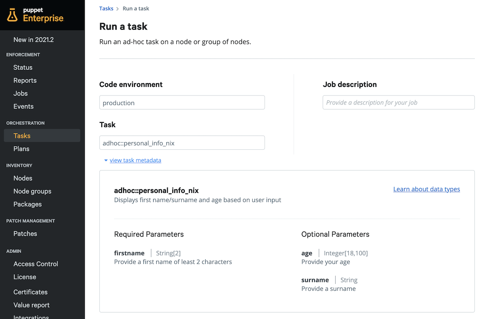
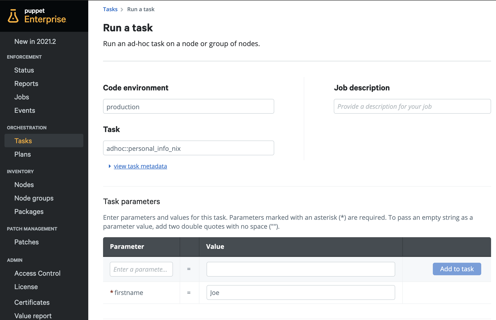
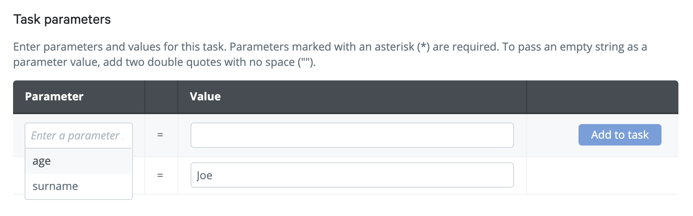
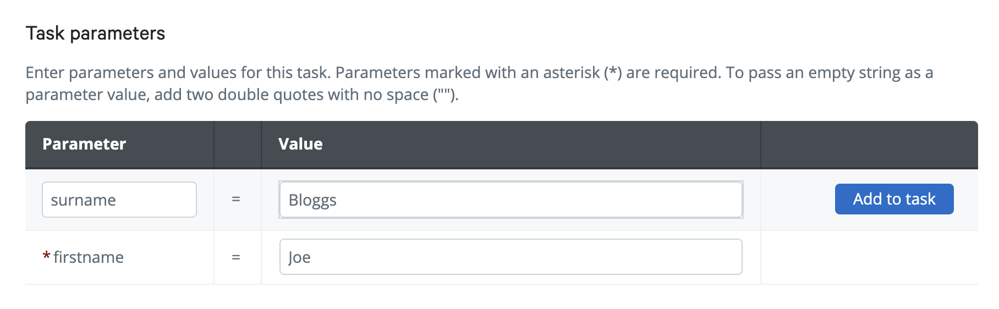
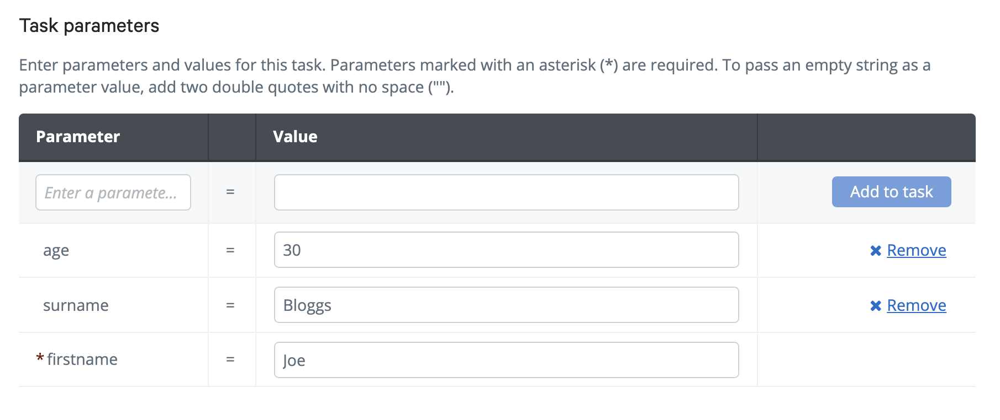
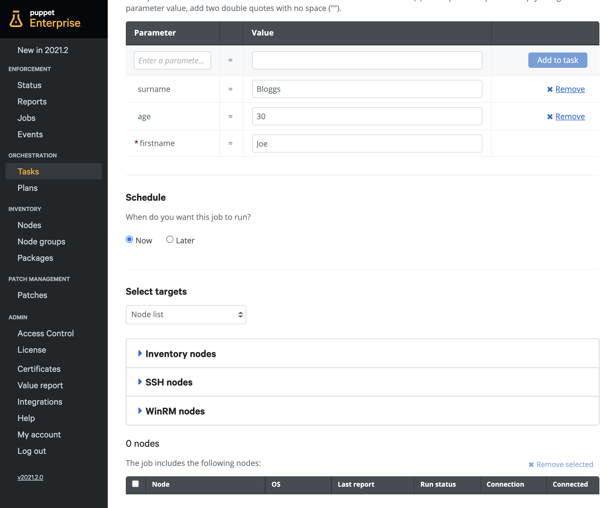
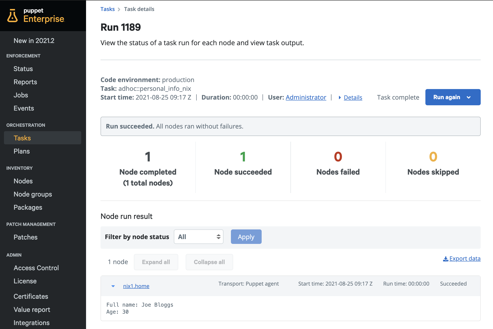
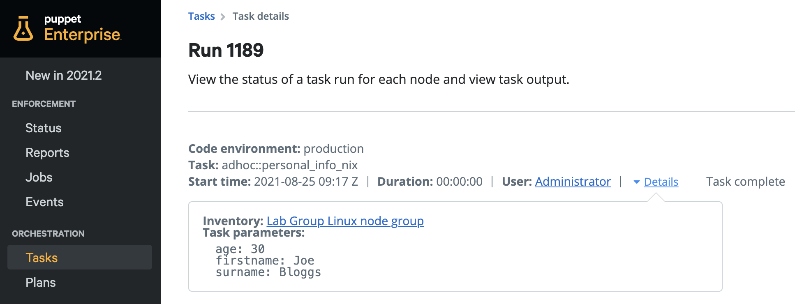
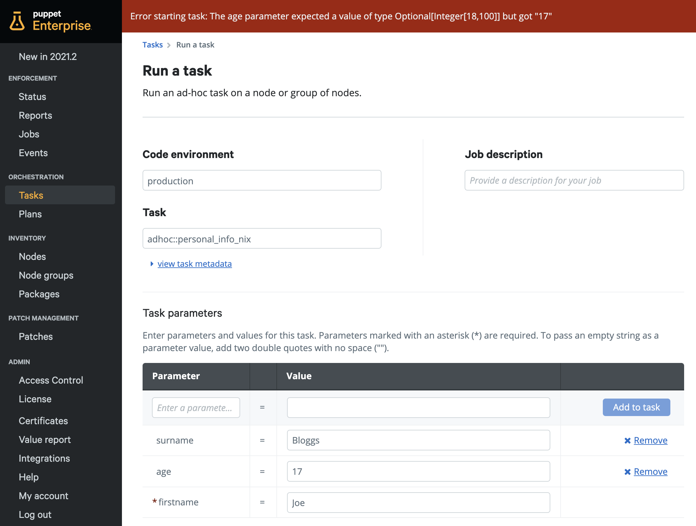
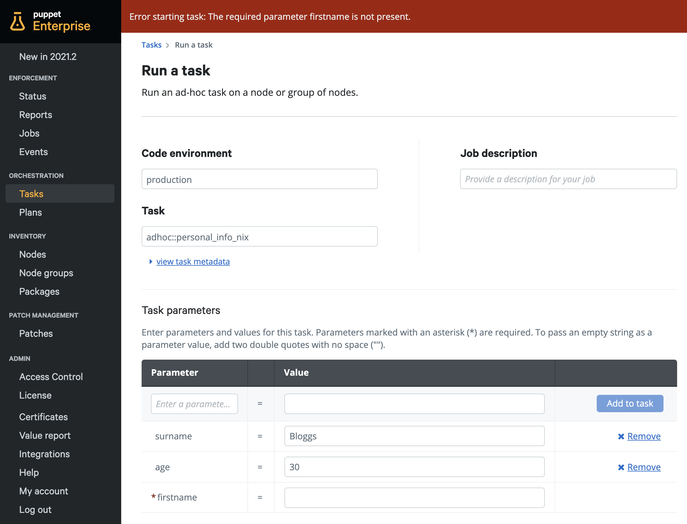

<div class="tocoutline">

### Table of Contents

<div class="toc">

- [Creating Task files](#creating-task-files)
- [Task Metadata Content](#task-metadata-content)
  - [Adding a Description](#adding-a-description)
  - [Adding a Parameter](#adding-a-parameter)
  - [Adding multiple parameters](#adding-multiple-parameters)
- [Script content](#script-content)
- [Deploying configurations](#deploying-configurations)
- [Running Tasks in PE](#running-tasks-in-pe)
  - [Choosing Targets](#choosing-targets)
  - [Running your Task and reviewing results](#running-your-task-and-reviewing-results)
- [Summary](#summary)

</div>

</div>

## Creating Task files<a href="#creating-task-files" aria-hidden="true"></a>

We’ll start off by creating the script and associated Task Metadata file in the Control Repo.

**Script name**: `personal_info_nix.sh`

**Metadata name**: `personal_info_nix.json`

As we’re using the Puppet template Control Repo, we can simply create these files within the **tasks** directory of the **adhoc** module.


```
├─ controlrepo/
    └─ site-modules/
        └─ adhoc/                       
            └─ tasks/
                └─ personal_info_nix.sh     
                └─ personal_info_nix.json  
```


## Task Metadata Content<a href="#task-metadata-content" aria-hidden="true"></a>
This task will need 3 parameters that users can specify:

* `firstname`
* `surname`
* `age` 

We'll also want to provide an overall description for the task, as well as a description for each parameter.

Let's start off by creating the description for our task.

### Adding a Description<a href="#adding-a-description" aria-hidden="true"></a>
Before adding parameters, we’ll create a basic description for our task. This should tell the user exactly what the task does. We specify this with the `description` key within the task metadata.


```json
{
     "description": "Displays first name/surname and age based on user input"
   }
```


### Adding a Parameter<a href="#adding-a-parameter" aria-hidden="true"></a>
As we'll be adding parameters to our task, It’s crucial that you first specify an `input_method`. This tells Puppet how it should make parameter values available during script execution on the target host:

* For Linux, specifying `environment` will cause parameters to be available as bash environment variables named `$PT_VARNAME`.
* For Windows, specifying `powershell` will cause parameters to be available as Powershell named variables with identical names to the parameters of the task.

To add parameters we need to specify the `parameters` key followed by the parameter name and it’s attributes. 

Within the `parameters` key, `type` is mandatory but `description` is optional. 

Under `type`, you can specify the parameter <a href="https://puppet.com/docs/bolt/latest/writing_tasks.html#common-task-data-types" target="_blank">data type</a> (String, Integer boolean etc) and any parameter restrictions, this could be character length or whether the parameter is optional or not. In this example, the `firstname` parameter is mandatory and requires a string of at least 2 characters.


```json
{
     "description": "Displays first name/surname and age based on user input",
     "input_method": "environment",
     "parameters": {
       "firstname": {
           "description": "Provide a first name of least 2 characters",
            "type": "String[2]"
      }
     }
   }
```


### Adding multiple parameters<a href="#adding-multiple-parameters" aria-hidden="true"></a>

It’s easy to add multiple parameters, the syntax is virtually the same as before except the parameter preceding needs to include a comma before specifying the new parameter, as per the JSON format.

We’re going to add two more parameters to this task, `surname` and `age`.

* `surname` is an optional string of any length. 

* `age` is an optional parameter which will only accept integers between 18 to 100.


```json
{
     "description": "Displays first name/surname and age based on user input",
     "input_method": "environment",
     "parameters": {
       "firstname": {
           "description": "Provide a first name of least 2 characters",
            "type": "String[2]"
       },
       "surname": {
           "description": "Provide a surname",
            "type": "Optional[String]"
       },
       "age": {
             "description": "Provide your age",
             "type": "Optional[Integer[18,100]]"
        }
     }
   }
```


That’s it! We’ve built task metadata with a description for the overall task, 3 parameters with validation and a description for each of the parameters. We’re ready to move on and build the corresponding script. 

## Script content<a href="#script-content" aria-hidden="true"></a>

To leverage user input via task parameters specified in the task metadata above, environment variables in shell scripts must be prefaced with the **PT_** prefix (**Puppet Task**). You can see in this script, we have 3 task variables: `$PT_firstname`, `$PT_surname` and `$PT_age` which directly correspond to the task parameters in our task metadata `firstname`, `surname` and `age`.


```bash
#!/bin/bash

# Validation of "firstname" and "surname" puppet task inputs
if [[ $PT_firstname ]] && [[ $PT_surname ]]; then
   echo "Full name:" $PT_firstname $PT_surname
else 
   echo "First name:" $PT_firstname
fi

# Validation of "age" input
if [[ $PT_age ]]; then
   echo "Age:" $PT_age
fi
```


## Deploying configurations<a href="#deploying-configurations" aria-hidden="true"></a>

Once you’ve created your script content and pushed it to your Control Repo, it should be available on the Puppet Server within a few seconds. This will happen automatically if the Puppet Server (via Code Manager) is set to sync with source control each time there’s a commit to the Control Repo, Alternatively, you’ll need to run `puppet-code deploy --all --wait` directly on the Puppet Server to pull the newest version of the Control Repo. 

## Running Tasks in PE<a href="#running-tasks-in-pe" aria-hidden="true"></a>

Once the Control Repo syncs with the Puppet Server, your tasks should be available in the Puppet Enterprise Console - From the sidebar under **Orchestration**, choose **Tasks** then **Run a task**.

Below you can find the `adhoc::personal_info_nix` task and its associated Task Metadata found in the `personal_info_nix.json` file. You can see the task description, the various parameters available to the task with their associated descriptions and whether those parameters are **required** or **optional**.



Below the Task Metadata, you can specify the parameter values. Required parameters will be shown as default and marked with an asterisk.



To add optional parameter values, click  _Enter a parameter name_, choose a parameter, enter a value and then click **Add to task**. You can then input the parameter value and run the task on your target nodes.








### Choosing Targets<a href="#choosing-targets" aria-hidden="true"></a>

Now that you’ve filled in all the relevant parameters for your task, it’s time to run it against some targets. Those targets can either be nodes in inventory (agent or agentless) or a new SSH/WinRM target. 



You can also target nodes by node groups and PQL queries but we’ll dive further into PQL queries in the Going Further section.


### Running your Task and reviewing results<a href="#running-your-task-and-reviewing-results" aria-hidden="true"></a>

When you’re ready, you can click **Run task** at the bottom right.

Once your task has successfully completed, at the bottom of the page you can find the output from your task on your target node under **Node run result**

 

At the top of the page you will see some key information. All task based activity within Puppet Enterprise is logged making it really easy to retrospectively view previous activities that have taken place within Puppet Enterprise such as which task was run, who ran it, what parameters were specified etc. You can find this information and more at the top of each task run. Here’s a quick walkthrough of some of that info:


* **Code environment:** This environment corresponds to branches within the Control Repo of the same name containing code specific to that environment (for example “production” or “development”).
* **Task name:** Name of Task chosen for this run
* **Start time:** What time the Task run was initiated
* **Duration:** How long it took for the run  to complete across all target nodes
* **User:** Name of the user that has run the Task
* **Details:** Inventory details or parameters passed to Task

	


## Parameter enforcement<a href="#parameter-enforcement" aria-hidden="true"></a>
Parameter values are verified by the Puppet Server against the task metadata requirements before running the task. The Puppet Server will restrict task execution if the parameter input is invalid. Let's take a look at what parameter enforcement looks like in the context of this task.

### Example: Invalid parameter input 1

In the Task Metadata, the **age** parameter had a requirement of an optional integer between 18 - 100. In this example we purposely input "17". 



### Example: Invalid parameter input 2

The **firstname** parameter had a requirement is a required string of at least 2 characters. In this example we purposely left this field blank.



## Summary<a href="#summary" aria-hidden="true"></a>

This was a simple example of how you can easily make your scripts more robust yet consumable to end users. Tasks are a really simple way to enable self service for other teams who don’t have Puppet or scripting skills but can still “consume" automation through Puppet.
