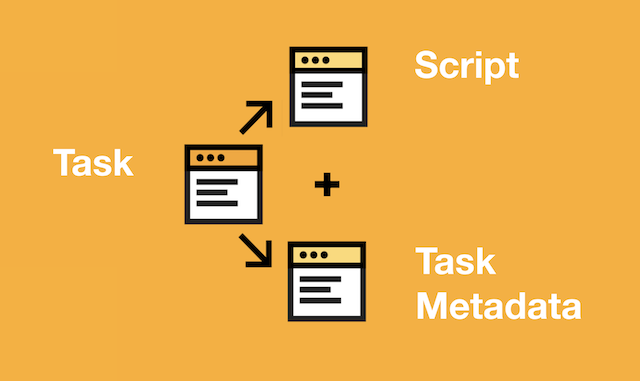
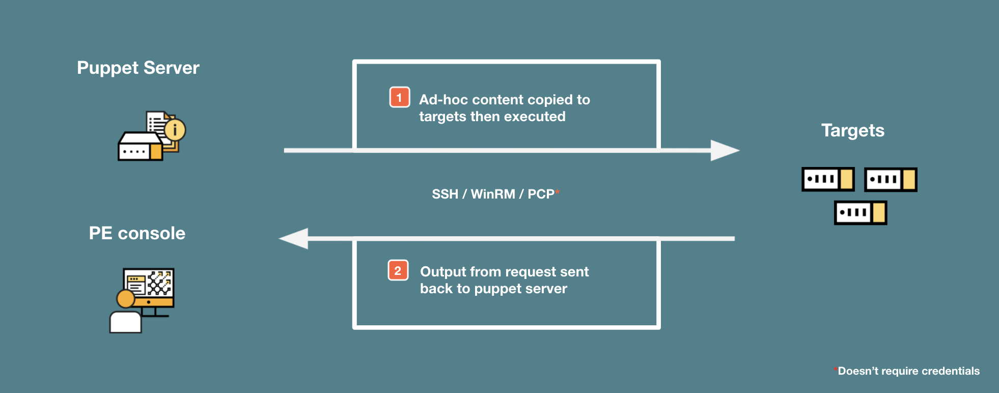

<div class="tocoutline">

### Table of Contents

<div class="toc">

- [What is a Task?](#what-is-a-task)
- [Use Cases](#use-cases)
- [Benefits](#benefits)
- [How do they work?](#how-do-they-work) 
  - [Components of a Task](#components-of-a-task)
  - [Do I need to use Task Metadata?](#do-i-need-to-use-task-metadata)
  - [What happens during a Task run?](#what-happens-during-a-task-run)
  - [Storage](#storage)
  - [Naming](#naming)
- [Running Tasks in PE](#running-tasks-in-pe)
- [Examples](#examples)
- [Troubleshooting](#troubleshooting)

</div>

</div>

# What is a Task?<a href="#what-is-a-task" aria-hidden="true"></a> 

A Puppet Task enables you to easily automate ad hoc automation tasks and eliminate manual work across your infrastructure and applications. You can take your existing scripts, in any programming or scripting language and run them easily across your estate, using the PCP protocol (Puppet agent), SSH or WinRM. Puppet Tasks are similar to <a href="https://puppet.com/docs/bolt/latest/bolt.html" target="_blank">Bolt Tasks</a> which means that it’s really easy to leverage your existing Bolt Tasks within Puppet Enterprise.

# Use Cases<a href="#use-cases" aria-hidden="true"></a>

Due to the ad hoc nature of Tasks, there are some use cases where this method is particularly appropriate such as:

* Patching
* Vulnerability management
* Network device management
* Maintenance tasks:
    * Rotate logs
    * Back ups
    * Restart system services


# Benefits<a href="#benefits" aria-hidden="true"></a>

* Low Barrier to entry - Get started immediately with scripts you already have (in any language)
* Explicitly describe how to achieve automation tasks, in sequence
* Agentless Flexibility (SSH/WinRM)
* Can also be agent based for more secure communication and faster execution
* Easily create self service Tasks for “consumers of automation” with built-in documentation and parameter validation.


# How do they work?<a href="#how-do-they-work" aria-hidden="true"></a>

## Components of a Task<a href="#components-of-a-task" aria-hidden="true"></a>

* ### Script

    You can choose any script, written in any language to become a task in Puppet Enterprise, providing that your target node has the relevant language runtimes and can execute the script. This means you can leverage your existing investments and workflows when using Puppet Tasks.

* ### Task Metadata

    Task metadata is a JSON file that accompanies a script and shares the same name as the script, but with a JSON file extension. The file contains a description for the Task itself, as well as any of the parameters belonging to the Task. It also allows you to easily control which parameters are mandatory vs optional and what input values/types are allowed for each parameter. Task metadata also enables a number of more advanced capabilities, which you can find documented <a href="https://puppet.com/docs/bolt/latest/writing_tasks.html#task-metadata" target="_blank">here</a>.

    <div class="size80margin">

    

    </div>


## Do I need to use Task Metadata?<a href="#do-i-need-to-use-task-metadata" aria-hidden="true"></a>


No, you don’t _have_ to use Task Metadata to get started with Tasks, you can simply add a script to the relevant location and omit a Task Metadata file. You will still end up with a “Task” (i.e. your script) that you can run against targets in PE with very little effort.

If you don’t use Task Metadata, you’ll not have the ability to add built-in documentation for users or add defined inputs to your task and validate them. You can still run a Task with parameters even if it has no metadata, but you’ll have to manually type in the parameters. 

Whilst we would recommend using Task Metadata, it can always be added in the future, whenever you’re ready!


## What happens during a Task run?<a href="#what-happens-during-a-task-run" aria-hidden="true"></a>

1. The Puppet Server will copy the Task content to remote targets agentlessly via SSH or WinRM or via the Puppet Agent transport (PCP). 
2. It will then run the Task on the target and return the output to the Puppet console via the Puppet Server.

   <div class="size80margin">

   

   </div>

Credentials aren't required for Tasks executed against Puppet Agent nodes. This is made possible by the Puppet Agent, which is already authenticated with Puppet Server and has full privileges to make changes on nodes. However, Role based access control (RBAC) ensures that these privileges cannot be abused. RBAC can used to limit Task execution to ensure teams can only run Tasks that are specific to their team. 


## Storage<a href="#storage" aria-hidden="true"></a>

Tasks will be recognized and available in Puppet Enterprise if they are contained within a `tasks` subdirectory of a module. A module is a container for Puppet automation in Puppet Enterprise. We’ll go more in depth on modules and their uses in the further sections.

Within the <a href="https://github.com/puppetlabs/control-repo" target="_blank">Puppet Template Control Repo</a>, the `adhoc` directory is technically a module, this means that if you have collection of existing scripts that you’d like to have available as Tasks in Puppet Enterprise, you can simply add them to your Control Repo within the **site-modules/adhoc/tasks** directory.

**Tasks without Metadata Example**

<div class="noninteractive">

```
control-repo/
 └─ site-modules/
    └─ adhoc/
       └─ tasks/
          ├─ disk_cleanup.sh
          └─ windows_feature.ps1
```

</div>


**Tasks with Metadata Example**

<div class="noninteractive">

```
control-repo/
└─ site-modules/
   └─ adhoc/
      └─ tasks/
         ├─ disk_cleanup.sh
         ├─ disk_cleanup.json
         ├─ windows_feature.ps1
         └─ windows_feature.json
```

</div>

Below you can find an example of some basic Task Metadata that provides a description for the disk_cleanup task:

`disk_cleanup.json`

```json
{
     "description": "This task performs a disk clean up"
   }
```

If you’re not using the Puppet template Control Repo or want to create a separate module for your tasks for a specific team for example, you can simply add a directory within **site-modules** with a **tasks** subdirectory and then add your scripts/tasks:

**Module Example (ops_team)**

<div class="noninteractive">

```
control-repo/
└─ site-modules/
   └─ ops_team/
      └─ tasks/
         ├─ disk_cleanup.sh
         └─ windows_feature.ps1
```

</div>

## Naming<a href="#naming" aria-hidden="true"></a>

Task names (script and Task Metadata filenames) can only use:

* Only lowercase characters

* Underscores
  
* Numbers

If you’re adding Task Metadata to your script then you must name your script with the same filename as the script file itself:


**Linux Script name:**  `disk_cleanup.sh`

**Linux Metadata name:** `disk_cleanup.json`

-------

**Windows Script name:**  `windows_feature.ps1`

**Windows Metadata name:** `windows_feature.json`


**Task location**
<div class="noninteractive">

```
adhoc/
 └─ tasks/
    ├─ disk_cleanup.sh
    ├─ disk_cleanup.json
    ├─ windows_feature.ps1
    └─ windows_feature.json
```

</div>

> Single platform Tasks (as shown above) within the same module cannot have the same name, however cross platform Tasks can.


### Namespacing


Puppet uses the namespacing syntax:

`MODULENAME::SCRIPTNAME`

Based on this syntax, the Tasks below will show in the PE console as: 

`adhoc::disk_cleanup`

`adhoc::windows_feature`

**Task location**
<div class="noninteractive">

```
adhoc/
 └─ tasks/
    ├─ disk_cleanup.sh
    ├─ disk_cleanup.json
    ├─ windows_feature.ps1
    └─ windows_feature.json
```

</div>

#### Cross Platform Tasks

With cross platform Tasks, you can create a single Task Metadata file which specifies which script the Task should use based on which shell is installed on the target.

Here's an example of cross platform Task metadata naming and location:

<div class="noninteractive">

```
site-modules/
    └─ adhoc/
       └─ tasks/
          ├─ disk_cleanup_nix.sh
          ├─ disk_cleanup_win.ps1
          └─ disk_cleanup.json
```

</div>

`disk_cleanup.json`

```json
{
  "description": "This is a description for my Cross Platform task",
  "implementations": [
    { "name": "disk_cleanup_nix.sh", "requirements": ["shell"] },
    { "name": "disk_cleanup_win.ps1", "requirements": ["powershell"] }
  ]
}
```

This will now result in 3 Tasks showing up in the PE console, the cross platform Task and the two individual platform Tasks:

`adhoc::disk_cleanup`

`adhoc::disk_cleanup_nix`

`adhoc::disk_cleanup_win`


If you only want one Task to appear in the PE console, you should give both scripts and Task metadata the same name.

> This is only possible with cross platform Tasks, single platform tasks must have unique names.

Here's an example of a single cross platform Task:

<div class="noninteractive">

```
site-modules/
    └─ adhoc/
       └─ tasks/
          ├─ disk_cleanup.sh
          ├─ disk_cleanup.ps1
          └─ disk_cleanup.json
```

</div>

`disk_cleanup.json`

```json
{
  "description": "This is a description for my Cross Platform task",
  "implementations": [
    { "name": "disk_cleanup.sh", "requirements": ["shell"] },
    { "name": "disk_cleanup.ps1", "requirements": ["powershell"] }
  ]
}
```

This will now result in a single cross platform Task showing up in the PE console: 

`adhoc::disk_cleanup`


# Running Tasks in PE<a href="#running-tasks-in-pe" aria-hidden="true"></a>

Once the Control Repo syncs with the Puppet Server, your Tasks should be available In the Puppet console and ready to run.

1. From the sidebar under **Orchestration**, click **Tasks** then **Run a task**.
2. Under **Task**, in the _Enter task to run_ textbox, you can click and then scroll to find your Task.
3. If your Task has metadata, you can view it by clicking **view task metadata**.
4. Below, fill in your relevant parameters, if you have any.
5. Choose targets by selecting them from a **Node List**, **PQL Query** or **Node Group**.
6. Once you’ve chosen your targets, click **Run Task**.

# Examples<a href="#examples" aria-hidden="true"></a>
You can find some Task and Task metadata examples within the <a href="https://puppet-enterprise-guide.com/theory/task-example.html" target="_blank">Task Example Walkthrough</a> page and the <a href="https://github.com/kinners00/puppet-examples/tree/production/examples/tasks" target="_blank">Puppet Examples repo</a>.

# Troubleshooting<a href="#troubleshooting" aria-hidden="true"></a>

Once you've added your Task to the Control Repo, if the Task or it's Metadata doesn’t appear in the PE console after a minute or so (could be longer for a larger code base), there could be a few potential problems:

1. **Your Task isn’t in a location where Puppet looks for Tasks**

    See [Storage](#storage) above.

2. **Your Task/script name isn't valid**

    See [Naming](#naming) above.

3. **Your Task Metadata is invalid**

   If your Task is showing in the Puppet Console but not your Task Metadata, it's most likely invalid. Review examples in [Task examples](#task-examples) and if you're still having trouble, we would recommend that you consider using an IDE such as <a href="https://code.visualstudio.com/" target="_blank">Visual Studio Code</a> with the <a href="https://puppet-vscode.github.io" target="_blank">Puppet</a> extension. This will help keep you on track when writing Puppet Code, Plans, Tasks and Task Metadata to ensure that syntax is valid.

4. **You need to perform a Code Deploy on the Puppet Server**

    Ensure code has been deployed to the Puppet Server. If you don't have webhooks configured to automatically trigger code deployment, you'll need to run the `puppet-code deploy` command on the Puppet Server - you can find more info on how to perform a manual code deploy <a href="https://puppet.com/docs/pe/latest/puppet_code.html#deploy_environments" target="_blank">here</a>.

5. **There’s a connection issue between your Workstation, Control Repo or Puppet server**

    If you’re pushing configurations locally from your own workstation, ensure that commits are successfully syncing with your source control provider, you can do this by logging on to your chosen platforms web console and check that commits are up to date. If this is working, you’ll then need to check the SSH connection between the Puppet Server and your source control platform. The issue may lie with your SSH keys or firewall configuration on the Primary Puppet Server and/or your source control providor. If you’ve been following this guide, verify you’ve opened the relevant ports as described in <a href="https://puppet-enterprise-guide.com/labs/lab-install-pe.html" target="_blank">LAB: Install PE</a> and that you've followed the steps in <a href="https://puppet-enterprise-guide.com/labs/lab-set-up-the-control-repo.html" target="_blank">LAB: Set up the Control Repo</a>. If you’re still having trouble, check out <a href="https://puppet.com/docs/pe/latest/code_mgr_config.html" target="_blank">configuring code manager</a> in the PE docs. <a href="https://puppet.com/docs/pe/latest/code_mgr_troubleshoot.html" target="_blank">Troubleshooting Code Manager</a> can also be a useful resource when troubleshooting code deployment issues.
