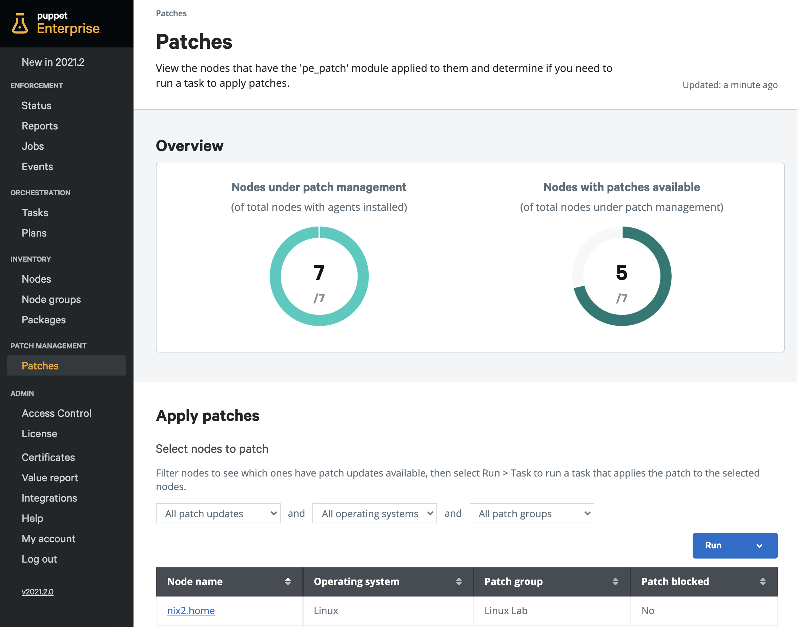
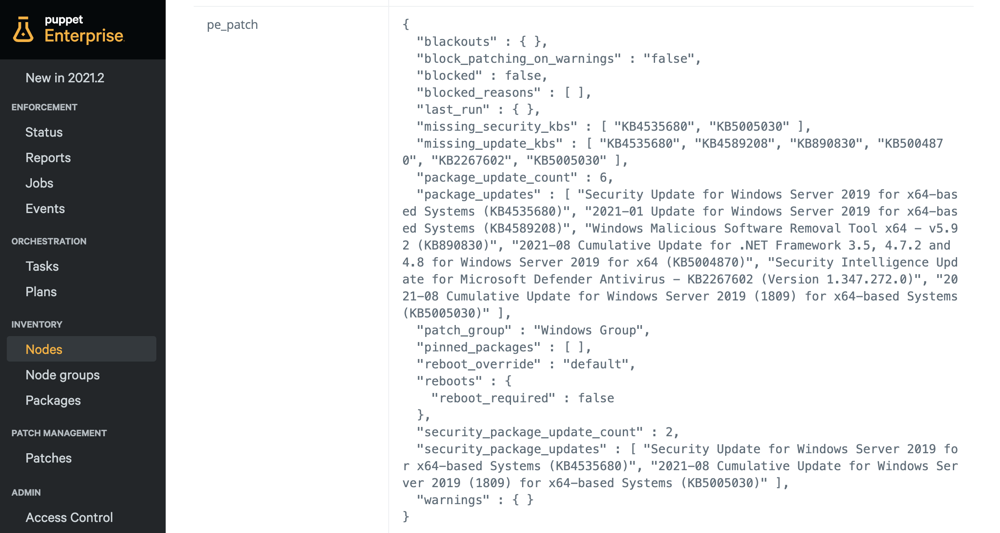

### Table of Contents

- [Overview](#overview)
- [How does it work?](#how-does-it-work)
  - [Patch Management Compatibility](#patch-management-compatibility)
  - [Onboarding nodes](#onboarding-nodes)
      - [Example patching node group structures](#example-patching-node-group-structures)
    - [pe_patch class parameters](#pe_patch-class-parameters)
  - [Reviewing Patch Information](#reviewing-patch-information)
  - [Patching Nodes](#patching-nodes)
    - [Patch Task Parameters](#patch-task-parameters)
      - [Reboots](#reboots)
      - [Security patches](#security-patches)
      - [Additional Parameters](#additional-parameters)
  - [Patch Retrieval Cadence](#patch-retrieval-cadence)
  - [Alternative Approaches](#alternative-approaches)

# Overview

Patch Management in Puppet Enterprise allows you to easily keep your estate up to date with the latest software and security patches, at scale. It comes out of the box and is simple to set up and use. It also can be customised to fit your organisation's specific patching requirements that may require additional steps such as pre and post-patching tasks.

# How does it work?

Under the hood, Puppet Enterprise uses the `pe_patch` module (bundled with your PE installation) to leverage OS level tools or APIs to find patches for nodes and stores patch information in the form of a fact named `pe_patch`. 

On Linux distributions, Puppet will interact with package managers like YUM, APT, DNF etc. On Windows distributions it’ll leverage the Windows update service and will also support Windows Server Update Services (WSUS) through the Windows update service.

PE patch management will find both regular software and security patches. To find security updates the `pe_patch` module uses security metadata where available. For example, Red Hat and Oracle Enterprise Linux provide security metadata through relevant YUM repositories. However, not all Linux repos support security specific metadata. In this case, only regular package patch information will be provided. Windows provides both regular and security patch information by default.

Puppet does not manage the configuration of the patching OS level tools, as standard through Patch management. Puppet simply interacts with them to retrieve patch information and orchestrate the application of patches however, Puppet provides modules to manage which <a href="https://forge.puppet.com/modules/puppet/yum" target="_blank">YUM</a> and <a href="https://forge.puppet.com/modules/puppetlabs/apt" target="_blank">APT</a> repositories are installed on your nodes for Linux, and also provides a <a href="https://forge.puppet.com/modules/puppetlabs/wsus_client" target="_blank">WSUS</a> module to manage the configuration of the Windows Update agent.

> PE patch management expects that relevant package managers/Windows update services are configured correctly. PE cannot retrieve patch information or patch nodes if these services aren’t properly configured. If you’re having issues getting PE patch management working, first check that target nodes can pull patch information through it's native update/package management solution.

## Patch Management Compatibility

PE patch management works across most major operating system distributions on both Linux and Windows platforms. For further information on what’s supported, check out the <a href="https://puppet.com/docs/pe/latest/patch_management_setup.html#patch_management_compatibility" target="_blank">OS Compatibility matrix</a> in the PE docs.

## Onboarding nodes

To start using patch management, you’ll need to create node groups under the parent node group “PE Patch Management” and apply the `pe_patch` class. These nodes groups should correspond to the grouping of servers that make sense for your organisation - you can find a few simple [example patching node group structures](#example-patching-node-group-structures) below.

1. To set up patch management, navigate to the **Node Groups** page.
2. Click **Add Group** and select **PE Patch Management** as the parent name.
3. Enter a name for your node group.
4. Click **Add**.
5. Click on your newly created node group.
6. To the right of **Add new class** type `pe_patch` then select the class from the dropdown.
7. Click **Add class**.
8. From the **Parameter name** drop down, select **patch_group** and in the **value** section, enter the name of your patch group, for example, **App Team.** 
9. Once complete, click **Add to Node group** and then **Commit 1 change**. 
10. Run puppet on your node group by clicking **Run > Puppet > Run job**. 

    On this run, Puppet will gather patch information for each of your nodes and store it in the `pe_patch` fact. If the puppet run was successful and with intentional changes, you should be ready to review patch information.

### Example patching node group structures

#### Patching Cycle

| PE Patch Management (parent)   |
| -----------                    |
| Dev patching group             |
| Early patching group           |
| Regular patching group 1       |
| Regular patching group 2       |
| Late patching group            |
| No patching                    |

#### Business Unit

| PE Patch Management (parent)   |
| -----------                    |
| App team                       |
| Platform team                  |
| Business Dev                   |
| IT Admin                       |

#### Server Function

| PE Patch Management (parent)   |
| -----------                    |
| IIS Webservers                |
| Apache Webservers                |
| Chocolatey Server               |
| SQL Databases               |
| MYSQL Databases               |

### pe_patch class parameters

There are many more attributes that you can specify in the `pe_patch` class such as default reboot behaviour, pre and post patching scripts, blackout windows and more. You can check out all the available parameters <a href="https://puppet.com/docs/pe/latest/patch_management_setup.html#config_patch_management" target="_blank">here</a>.

## Reviewing Patch Information

There are two main ways to review patch information:

* The **Patches** page
* The `pe_patch` fact

### High Level Estate Overview

From the **Patches** page you can see **Nodes under patch management** and actively reporting patch information as well as **Nodes with patches available**. 

1. Navigate to the **Patches** page 
2. Under **Apply Patches** - **Select nodes to patch**. You can use these filters to understand patch information at a high level. See [Patch Filters](#patch-filters) for more information.
3. After you choose your filter(s), you'll see that the node list has been updated to reflect your filter results.

#### Patch Filters

| Filter Dropdowns                 | Function                                                         |
| -----------                      | -----------                                                      |
| All patch updates                | Security specific patch updates or regular system/package updates (if the target operating system supports security metadata) |
| All operating systems            | Filter by a given operating system such as Linux or Windows      |
| All Patch Groups                 | Choose a specific pre-defined patch group for targeted patching  | 

### Granular node level view

You can get detailed patch information for a specific node by reviewing the data stored within the `pe_patch` fact.

1. Navigate to **Nodes** and click on the name of your node 
2. Under the **Facts** tab, navigate to the `pe_patch` fact to get further information on specific patches available to your node.. 

## Patching Nodes

From the **Patches** page, you can filter nodes that you wish to patch by choosing the relevant criteria and running the `pe_patch::patch_server`task.

**Patching Immediately**

1. Navigate to the **Patches** page 
2. Filter nodes that you wish to patch (See [Patch Filters](#patch-filters) for more information).
3. Click **Run** then **Task**. 
4. Review the various [Task parameters](#task-parameters) and ensure they align with your desired outcome. 
5. Click **Run task.**

**Schedule Patch run**

1. Navigate to the **Patches** page.
2. Filter nodes that you wish to patch (See [Patch Filters](#patch-filters) for more information).
3. Click **Run** then **Task**. 
4. Review the various [Task parameters](#task-parameters) and ensure they align with your desired outcome. 
5. Under **Schedule**, choose **Later** and input your desired time and date. 
6. Once you’re done, you can click **Schedule job**.

### Patch Task Parameters

There are multiple useful task parameters that you can supply to the `pe_patch::patch_server`; however, the most frequently used parameters relate to handling reboots and security patches.

#### Reboots

As default, the reboot parameter is set to **never**, meaning that the task won't reboot nodes after applying patches, however reboots can be handled in a few different ways that may align with your patching process.

| Reboot Parameter   | Function                                                                                                                            |
| -----------        | -----------                                                                                                                         |
| never (default)    | The node never reboots during the task run, even if patches are applied.                                                            |
| always             | The node always reboots during the task run, even if no patches are required                                                        |
| patched            | The node reboots if patches are applied                                                                                             |
| smart              | Use the OS supplied tools, like needs_restarting on RHEL or a pending reboot check on Windows, to determine if a reboot is required |

#### Security patches

If you want to only apply security updates, you can add the **security_only** parameter and set it to **true.**

#### Additional Parameters

You can find more information on additional task parameters from the PE documentation <a href="https://puppet.com/docs/pe/latest/patch_management_patching_nodes.html#config_patch_task" target="_blank">here</a>. 

## Patch Retrieval Cadence

The `pe_patch` fact will refresh once daily on all platforms.

At the end of a `pe_patch::patch_server` task run, another scan of available updates will be performed to update the `pe_patch` fact, but this only happens immediately for Linux. For Windows, this happens upon the next boot as Windows often requires a reboot before installed updates are properly recognised as being present. 

## Alternative Approaches

If you require more advanced capabilities for patch management than the built in features in Puppet Enterprise provide you out of the box, check out the <a href="https://forge.puppet.com/modules/puppetlabs/patching_as_code" target="_blank">patching_as_code</a> module on the Puppet Forge. The `patching_as_code` module allows you achieve automated patching through desired state code and extends the capabilities of Puppet’s built in patch management features.
