<div class="tocoutline">

### Table of Contents

<div class="toc">

  - [Installing Git](#installing-git)
  - [Configuring Git](#configuring-git)
  - [Generating SSH Keys](#generating-ssh-keys)
  - [Copy SSH Public Key Content](#copy-ssh-public-key-content) 
  - [Adding SSH key to source control](#adding-ssh-key-to-source-control)
  - [Cloning the control repository](#cloning-the-control-repository)
  - [Setting up VS Code and Puppet Extension](#setting-up-vs-code-and-puppet-extension)
  - [Push a change through VS Code](#push-a-change-through-vs-code)
  - [Troubleshooting](#troubleshooting)

</div>

</div>

## Installing Git<a href="#installing-git" aria-hidden="true"></a>

In order to interact with a git based repository, you’ll need the git package installed locally on your workstation. It’s available for all platforms, Linux distros, Mac OSX and Windows. 

1. Download and Install Git - You can download Git directly <a href="https://git-scm.com/downloads" target="_blank">here</a>.

> There’s several steps and options to choose from when running through the installation however all of the defaults should be fine - However, double check that "Git bash" is selected during the installation. This is a prequisite for [Generating SSH keys](#generating-ssh-keys).

## Configuring Git<a href="#configuring-git" aria-hidden="true"></a>

When you commit a change to source control, the author's information must accompany that commit, therefore you cannot push any code until you configure your username and password.

1. To do this, simply run the commands below in a powershell window, substituting the name and email address for your own name and email address:

    ```shell
    git config --global user.name "Joe Bloggs"
    git config --global user.email "joe.bloggs@puppet.com"
    ```

2. You will also need to run these two commands to ensure line endings don’t become an issue for you when working with Git:

    ```shell
    git config --global core.autocrlf true
    git config --global core.safecrlf warn
    ```

## Generating SSH Keys<a href="#generating-ssh-keys" aria-hidden="true"></a>

We’ll leverage the `ssh-keygen` tool to create a SSH keypair.

> Ensure you've install Git with "Git bash" first as this software includes the relevant binaries required to generate SSH keys on command line.

1. Open a Git bash terminal window on your workstation by right clicking on your desktop (or folder of choice) and select "Git bash Here".

2. Run this command:

    ```bash
    ssh-keygen -t rsa
    ```

3. When asked to "Enter a file in which to save the key", press return/enter.

4. When asked for a passphrase, leave empty and press return/enter and press return once again when asked for confirmation of the passphrase. 

    The command output should look something like this:

    <div class="noninteractive">

    ```
    Your identification has been saved in /c/Users/JoeBloggs/.ssh/id_rsa
    Your public key has been saved in /c/Users/JoeBloggs/.ssh/id_rsa.pub
    The key fingerprint is:
    SHA256:JODllcvdmmkBM2zbnh9OLb472TLujbKt9NmarEJq+WM JoeBloggs@win1
    The key's randomart image is:
    +---[RSA 3072]----+
    |    . ....       |
    |   . + .B        |
    |    . oo.O .     |
    |       o+ + .    |
    |        S. * .   |
    |        . B + .  |
    |       + ..= =   |
    |      + E..+O*.  |
    |     . o.o+B&Bo  |
    +----[SHA256]-----+
    ```

    </div>

## Copy SSH Public Key Content<a href="#copy-ssh-public-key-content" aria-hidden="true"></a>

You’ve now generated a SSH keypair. You'll need to provide the public key content to your  source control providor in order to authenticate our workstation. It will do this by verifying the private key (held locally) is the "other half" of the pair that the public key belongs to. Once authenticated, you can clone a copy of the control repo locally and push new changes to source control without the need for additional authentication.


1. Navigate to the directory shown in the public key location from the command output and open the `id_rsa.pub` file in Notepad.

    _or_

    From the same bit bash terminal window, run this command and substitute your own your public key directory location shown in the command output

    ```bash
    cat /c/Users/JoeBloggs/.ssh/id_rsa.pub
    ```


2. Copy the public key content. It should look something like this:

    <div class="noninteractive">

    ```shell
    ssh-rsa AAAAB3NzaC1yc2EAAAADAQABAAACAQDGgevS4u4zi2CxPihqzVRZZ68tbStEXtb+
    +VmHIpoGiB6g085Vg5GHz8RmxlQ+gkr30/r2rOOCkwhlf96oavzYParYx+xfR2uA7qgwkh2X
    PY8+6Ju0dbjsVKxmfiKcTNkOU78ahAnbZ2+lMcs84wnEjkuemqlelveOFrfa5TCNqMrVHXii
    FiJn5R926ngdOlUaj0cbN0zGj4V7VH+6106iZmuH+JrdeWc8aaGPB7OMYM0+LwCM3mggLQu7
    oLeMYigCL79QbRS8AS3jIeoaLnHl7Rm+3ZbJcxq0urU1Tw9vLb28n8Mt4fUVSe+vaix3OOZu
    QrAjOJTWf88J5gApn210CSIg8tgbQVNEAZUIuU2nzVJnRKjdeY830TxzEEriBuW/dRXRlE65
    KSMpG+vKPD05g10Z1/LAioP7q+SEjERorrZjBh9Un9UPB4JC2yslBOQZSPEhNglOGMZn7af2
    14zOf7yRqAIJt8E46C+axbYr8pSPECrmyd5Gd/FG+3WUaaO0Xa6mFyws+dUSmDgFqnExVFwd
    aX1PTF16acu5Ab3dylSgdWkHp9/iSmIidcpNa4IUeNM4LMBNbdmCbOMAKdiQt1+oxtEm7G9H
    5NopqBbFq7C46Xe2atcyOi4Iz4KOMB82JHyszW+2hw7c9QO+63umJCwYgaNzLX6kaMfKzcBM
    Gw== JoeBloggs@win1.home
    ```

    </div>

## Adding SSH key to source control<a href="#adding-ssh-key-to-source-control" aria-hidden="true"></a>

Now that you’ve generated your SSH keys and copied the content of your public key, you need to add it to your source control provider's SSH keys store. 


1. Below you can find documentation on how to add your SSH public key to your source control provider of choice (follow the Gitlab instructions if you’ve been following the labs):

    <a href="https://docs.github.com/en/github/authenticating-to-github/connecting-to-github-with-ssh/adding-a-new-ssh-key-to-your-github-account" target="_blank">Github</a>

    <a href="https://www.tutorialspoint.com/gitlab/gitlab_ssh_key_setup.htm" target="_blank">Gitlab</a>

    <a href="https://confluence.atlassian.com/bitbucketserver0711/ssh-access-keys-for-system-use-1047557590.html" target="_blank">Bitbucket</a>

    <a href="https://docs.microsoft.com/en-us/azure/devops/repos/git/use-ssh-keys-to-authenticate?view=azure-devops" target="_blank">Azure DevOps</a>

## Cloning the control repository<a href="#cloning-the-control-repository" aria-hidden="true"></a>

Once you’ve added your SSH public key to your source control platform, you should be ready to clone a copy of the control repo via SSH. 

1. Navigate to your control-repo within your source control platform and look for the “clone with SSH” option (or similar phrasing) and copy the link provided.
2. Open a Git Bash terminal window on your workstation by right clicking on your desktop (or folder of choice) and select "Git Bash Here"
3. Clone the repo locally to your workstation:

    From the Git Bash terminal window, type `git clone`, followed by <span style="text-decoration:underline;">your own git repo address</span> that you copied earlier:

    ```markdown
    git clone git@<yoursourcecontrolhostname>:puppet/control-repo.git
    ```

    If the repo was cloned successfully, you should see something like this:

    <div class="noninteractive">

    ```
    git clone git@gitlab.company.com:puppet/control-repo.git
    Cloning into 'control-repo'...
    remote: Enumerating objects: 63, done.
    remote: Counting objects: 100% (63/63), done.
    remote: Compressing objects: 100% (39/39), done.
    remote: Total 3632 (delta 24), reused 50 (delta 18), pack-reused 3569
    Receiving objects: 100% (3632/3632), 442.05 KiB | 9.21 MiB/s, done.
    Resolving deltas: 100% (1782/1782), done.
    ```

    </div>

    You should then be able to navigate to the relevant directory to find your control repo locally on your workstation.

## Setting up VS Code and Puppet Extension<a href="#setting-up-vs-code-and-puppet-extension" aria-hidden="true"></a>

Now that you’ve got your control repo downloaded, it’s time to get VS Code and the puppet extension so that we can better interact with the control repo and puppet to create more configurations with ease.

1. Download and install VS Code. You can download VS Code for your workstation <a href="https://code.visualstudio.com/download" target="_blank">here</a>. 
2. Once you’ve downloaded and installed VS Code, you’ll need to download and install the Puppet PDK, which can be found <a href="https://puppet.com/try-puppet/puppet-development-kit" target="_blank">here</a>. It’s a prerequisite for some of the Puppet extensions functionality however, we’ll explore the PDK further in labs coming in the future.
3. Finally, you can install the puppet extension from this <a href="https://puppet-vscode.github.io" target="_blank">page</a>.

We’d recommend that you also check out the <a href="https://puppet-vscode.github.io/docs/features/" target="_blank">Puppet Extension docs</a> once you’re ready to start writing some puppet code.

## Push a change through VS Code<a href="#push-a-change-through-vs-code" aria-hidden="true"></a>

Now that all the prerequisites are out of the way, the control repo is downloaded, git is configured, VS Code and the puppet extension is installed, you are fully ready to make some changes via VS Code to your control repo and push them to source control directly from VS Code.


1. Open VS Code and choose **File** > **Open Folder** then navigate to the control repo click **open**. 
2. Now we’ve opened the control repo, let's edit the **README.md** file and add a line in there with the word “test”.

    <div class="size90margin">

    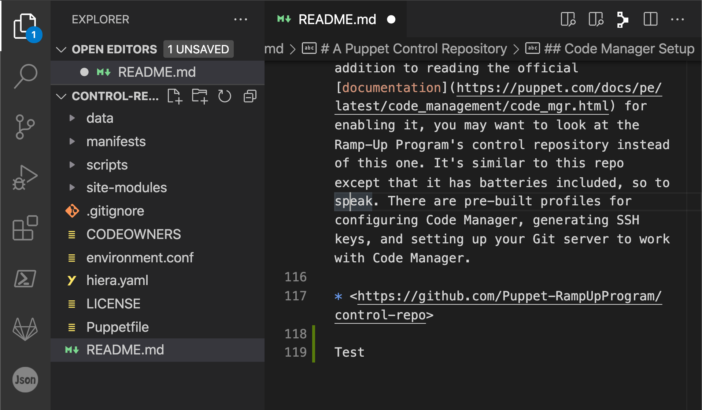

    </div>

    Once you’re done, you’ll notice a little dot on the file tab within VS Code. This means that there’s been a new change on this file but it’s not yet saved.

    <div class="size30margin">

    

    </div>

3. To save, simply navigate to **File** > **Save**. You can also press **ctrl + s** on Windows/Linux or **cmd + s** on MacOS. 
4. If everything has been set up correctly, you should now see a “**1**” badge on the source control icon from the sidebar on the left. 

    <div class="size10margin">

    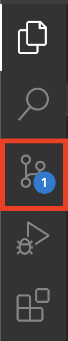

    </div>

    This indicates that there’s now 1 pending change locally in the control repo. Whilst the file has been saved locally, we haven’t pushed any changes directly to source control yet.

5. Click on the badge to see the file with pending change and then click on the **README.md** file under **Changes** to review your change.

    You’ll now see a side by side comparison of the change (before and after).

    <div class="size90margin">

    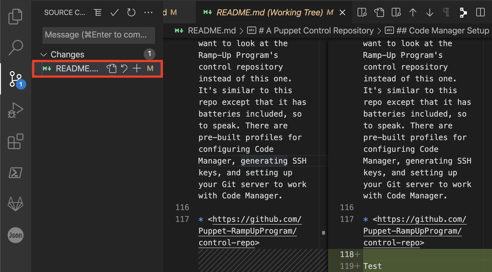

    </div>

6. If you’re happy with the change, from the sidebar, click the ellipsis(**...**) > **Changes** > **Stage all changes**. You should now see that your changes have moved under the **Stage Changes** category. This means your changes are now ready to commit.

    <div class="size80margin">

    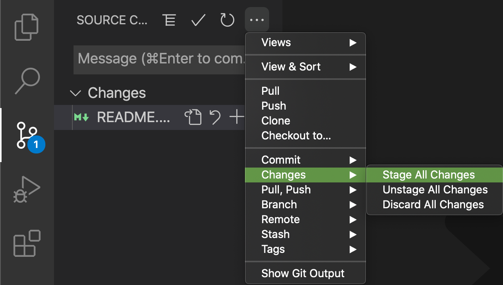

    </div>


    <div class="size50margin">
    
    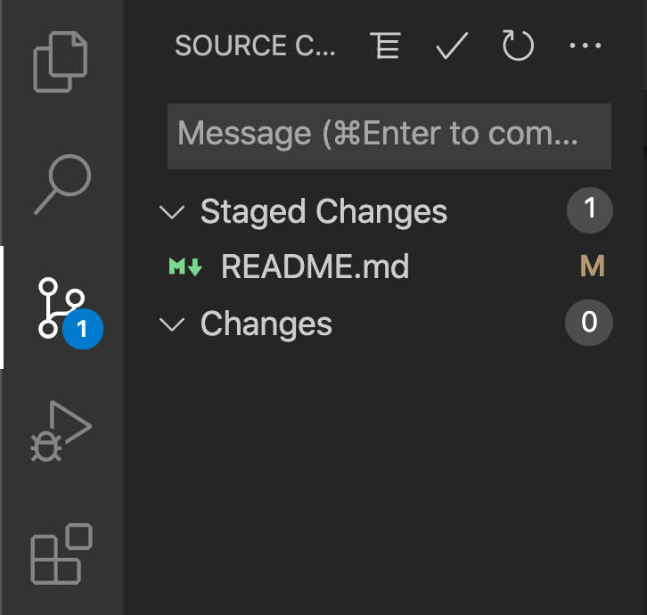

    </div>

7. You can easily add a message along with your commit by typing it in the **Message** field briefly identifying the content of the commit. When you’ve entered your commit message, click the **tick symbol** (✓). Your change is now committed with a message and ready to push.

    <div class="size50margin">

    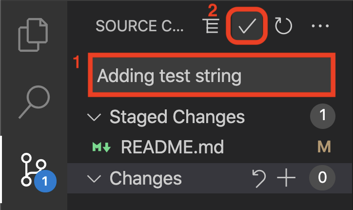

    </div>

    You’ll now see in the bottom left hand corner, there is 1 commit ready to push upstream to the control repo in source control. 

    <div class="size50margin">

    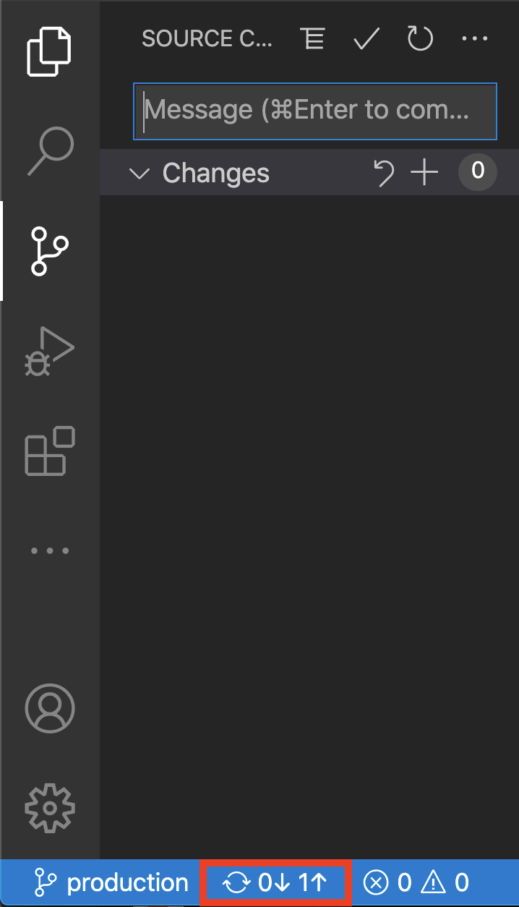

    </div>

8. To push the commit to the control repo, Click the ellipsis(**...**) > **Push.**

    <div class="size50margin">

    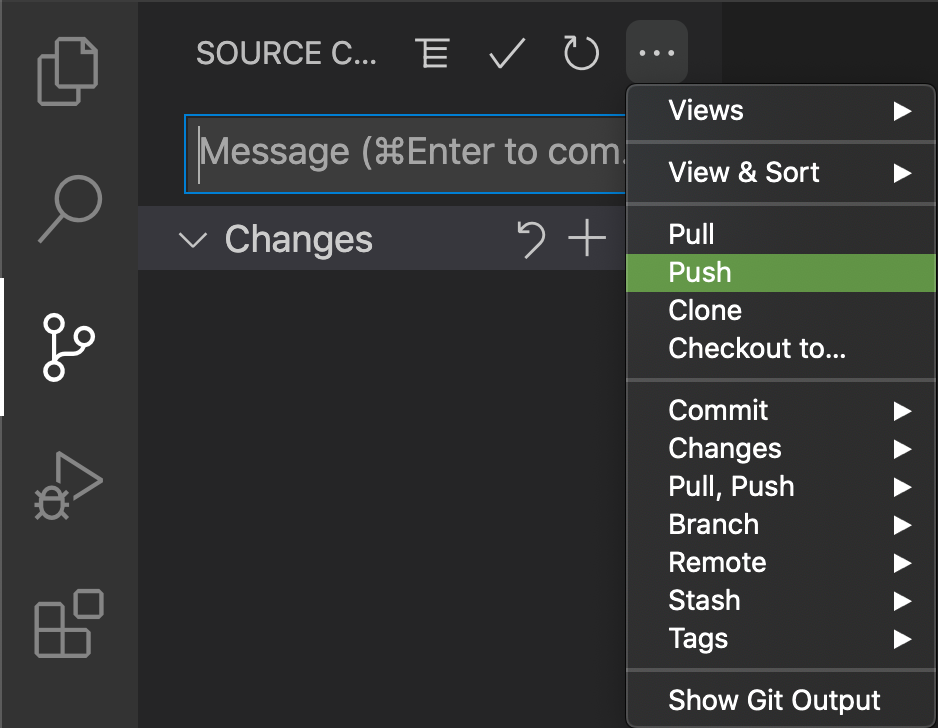

    </div>

    You should now see no pending changes to pull or push.

    <div class="size50margin">

    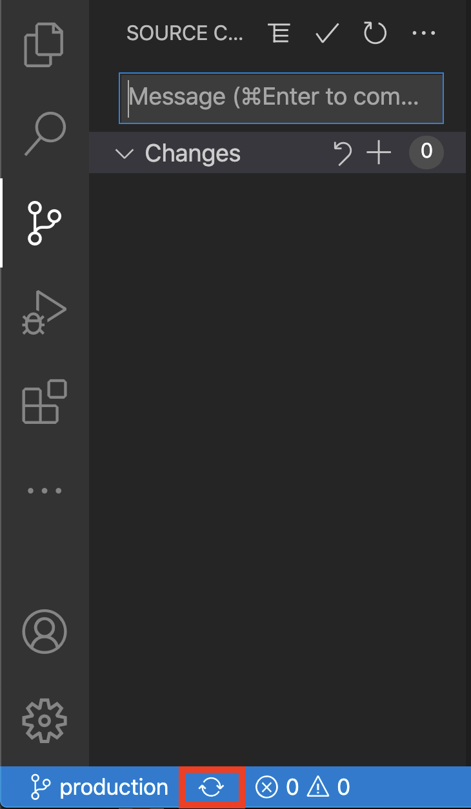

    </div>

9. Navigate to your source control platform and verify your commit has appeared as expected. It should display your commit message and Git username as configured in the earlier steps:

    <div class="size90margin">

    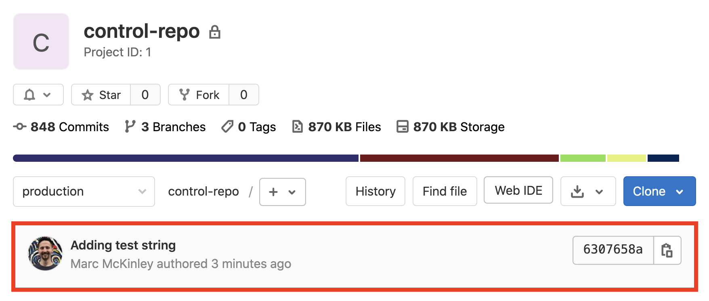

    </div>

    <div class="size90margin">

    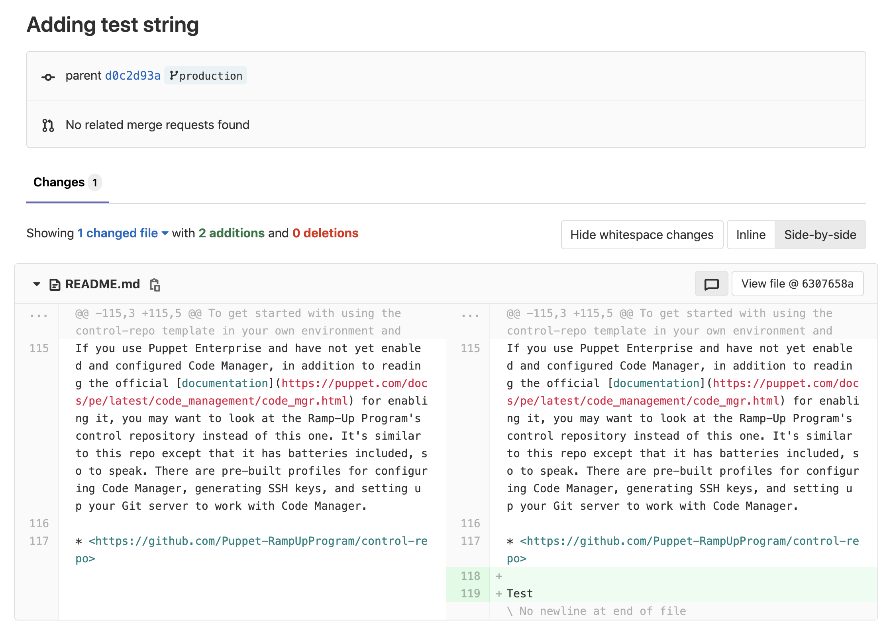
    
    </div>


## Troubleshooting<a href="#troubleshooting" aria-hidden="true"></a>
* If either the `git clone` or `ssh-keygen` command doesn't work, ensure that you've installed Git Bash as part of the Git installation.

* If you're having trouble finding your control repo even though the `git clone` executed successfully, It's possible that you may have cloned your control repo to an unintended location. Be sure to check where your present working directory is in the Git Bash terminal by running `pwd`.
